<div align="center">

# Sistema Inteligente de Reportes Ciudadanos con IA

## Proyecto Final del Diplomado en Desarrollo .NET

### Objetivo de Desarrollo Sostenible (ODS 11)

#### Ciudades y Comunidades Sostenibles
---
#### API REST desarrollada con **ASP.NET Core**, **Entity Framework Core**, **SQLite**, **Groq IA** y consumo de **APIs externas** mediante **HttpClient**.
---
## Documentación Y Pruebas Funcionales
</div>

---

#  Sistema Inteligente de Reportes Ciudadanos con IA

API REST desarrollada con **ASP.NET Core 8** para la gestión de reportes ciudadanos relacionados con problemáticas urbanas, incorporando **Inteligencia Artificial mediante la API de Groq**, servicios externos de geocodificación y persistencia de información mediante una base de datos relacional.

El sistema está orientado al registro, consulta, actualización, eliminación y análisis inteligente de reportes relacionados con situaciones que afectan la infraestructura y los espacios públicos.

---

## 1. Descripción del proyecto

### 1.1 Información General del Proyecto

**Nombre del sistema:** Sistema Inteligente de Reportes Ciudadanos con IA

**Tipo de proyecto:** API REST desarrollada sobre **ASP.NET Core 8**, diseñada bajo una arquitectura orientada a servicios e integrada con tecnologías de Inteligencia Artificial y servicios externos.

El proyecto corresponde al desarrollo de una solución para gestionar reportes ciudadanos relacionados con diferentes problemáticas urbanas.

Su propósito es centralizar la información reportada y facilitar su clasificación y priorización mediante Inteligencia Artificial.

Entre las principales problemáticas que pueden ser registradas se encuentran:

- Baches y deterioro de la malla vial.
- Fallas en el alumbrado público.
- Acumulación de residuos sólidos.
- Daños en parques y zonas verdes.
- Deterioro del mobiliario urbano.
- Afectaciones al espacio público.
- Otras incidencias relacionadas con la infraestructura urbana.

El ciudadano proporciona información como el título del incidente, una descripción detallada y la ubicación donde ocurre el problema.

Una vez registrado el reporte, el sistema almacena la información y utiliza la **API de Groq** para realizar un análisis automático del contenido.

El análisis mediante Inteligencia Artificial permite obtener:

- Categoría del incidente.
- Nivel de prioridad.
- Resumen del problema.
- Recomendación para su atención.

Adicionalmente, el sistema integra una API externa de geocodificación para complementar la información geográfica del reporte.

---

## 2. Objetivo

### 2.1 Objetivo general

Desarrollar una API REST denominada **Sistema Inteligente de Reportes Ciudadanos con Inteligencia Artificial**, orientada a la gestión eficiente de reportes relacionados con problemáticas urbanas, permitiendo registrar, consultar, actualizar, eliminar y analizar automáticamente la información mediante Inteligencia Artificial.

La solución busca contribuir al mejoramiento de la administración de los espacios públicos y apoyar el cumplimiento del **Objetivo de Desarrollo Sostenible (ODS) 11: Ciudades y Comunidades Sostenibles**.

### 2.2 Objetivos específicos

#### OE-01. Gestionar reportes ciudadanos

Diseñar e implementar una API REST que permita registrar, consultar, actualizar y eliminar reportes ciudadanos relacionados con problemáticas urbanas.

#### OE-02. Automatizar el análisis de los reportes

Integrar un servicio de Inteligencia Artificial mediante la API de Groq para analizar automáticamente el contenido textual de cada reporte.

#### OE-03. Integrar servicios externos

Consumir una API externa de geocodificación mediante `HttpClient` para complementar la información geográfica asociada a los reportes ciudadanos.

#### OE-04. Garantizar la calidad de la información

Implementar validaciones sobre los datos recibidos mediante DTOs y reglas de negocio.

#### OE-05. Facilitar la consulta y análisis de información

Desarrollar mecanismos de búsqueda y filtrado que permitan consultar reportes por diferentes criterios:

- Categoría.
- Prioridad.
- Estado.
- Rango de fechas.

#### OE-06. Documentar la API

Generar documentación técnica mediante **Swagger/OpenAPI**, describiendo los endpoints disponibles, modelos utilizados, parámetros de entrada, respuestas esperadas y posibles errores.

#### OE-07. Aplicar buenas prácticas de desarrollo

Construir la solución siguiendo principios de separación de responsabilidades, modularidad y escalabilidad.

---

## 3. Contexto y ODS 11 – Ciudades y Comunidades Sostenibles

El proyecto se desarrolla tomando como referencia el **Objetivo de Desarrollo Sostenible (ODS) 11: Ciudades y Comunidades Sostenibles**.

El sistema plantea una solución tecnológica orientada a digitalizar el proceso de registro y administración de problemáticas presentes en el entorno urbano.

### 3.1 Relación del proyecto con el ODS 11

El proyecto contribuye al ODS 11 mediante una plataforma que centraliza los reportes ciudadanos y permite que estos sean posteriormente analizados y organizados.

La integración de Inteligencia Artificial permite automatizar parte del proceso de clasificación y priorización de los reportes.

## 4. Contribución tecnológica

#### Centralización de la información

La información relacionada con los reportes ciudadanos se almacena en una plataforma centralizada.

#### Automatización mediante Inteligencia Artificial

La integración con la API de Groq permite analizar automáticamente la descripción de cada reporte para identificar:

- Categoría.
- Prioridad.
- Resumen.
- Recomendación.

#### Integración con servicios externos

La API de geocodificación permite complementar la información relacionada con la ubicación de los incidentes.

#### Gestión organizada de la información

El sistema proporciona mecanismos de búsqueda y filtrado para consultar los reportes según diferentes criterios.

---

## 5. Alcance del proyecto

El proyecto comprende el desarrollo de una **API REST** capaz de gestionar integralmente el ciclo de vida de los reportes ciudadanos.

### 5.1 Funcionalidades incluidas

#### Gestión de reportes

- Registrar nuevos reportes ciudadanos.
- Consultar todos los reportes registrados.
- Consultar un reporte específico mediante su identificador.
- Actualizar la información de un reporte existente.
- Eliminar reportes registrados.
- Consultar reportes utilizando diferentes criterios de búsqueda.

#### Integración con Inteligencia Artificial

La solución integra la API de Groq para realizar el análisis automático del contenido de los reportes.

La Inteligencia Artificial permite:

- Clasificar el tipo de incidente.
- Asignar un nivel de prioridad.
- Generar un resumen.
- Proponer una recomendación.

#### Integración con servicios externos

El sistema consume una API externa de geocodificación mediante `HttpClient`.

#### Persistencia de información

La información se almacena de forma persistente utilizando una base de datos relacional.

#### Consultas y filtros

La API contempla mecanismos de consulta mediante:

- Categoría.
- Prioridad.
- Estado.
- Rango de fechas.

#### Documentación y calidad

El proyecto contempla:

- Documentación mediante Swagger/OpenAPI.
- Validaciones de entrada.
- Manejo de errores.
- Arquitectura modular basada en ASP.NET Core 8.

### 5.2 Funcionalidades fuera del alcance

La versión inicial no contempla:

- Aplicación móvil.
- Aplicación web para ciudadanos.
- Sistema de autenticación y autorización.
- Panel administrativo gráfico.
- Notificaciones en tiempo real.
- Integración con sistemas gubernamentales reales.

Estas funcionalidades podrán considerarse como mejoras para futuras versiones.

---

### 5.3 Características principales

| Característica | Descripción |
|---|---|
| API REST | Permite gestionar los reportes mediante servicios HTTP. |
| CRUD de reportes | Registro, consulta, actualización y eliminación de reportes. |
| Inteligencia Artificial | Análisis automático mediante la API de Groq. |
| Clasificación automática | Determinación de la categoría del incidente. |
| Priorización | Asignación automática de un nivel de prioridad. |
| Resumen automático | Generación de un resumen del incidente. |
| Recomendaciones | Generación de recomendaciones para la atención. |
| Geocodificación | Complemento de la información geográfica. |
| Persistencia | Almacenamiento de información en la base de datos. |
| Filtros | Consulta mediante diferentes criterios. |
| Validaciones | Control de los datos recibidos. |
| Swagger/OpenAPI | Documentación y prueba interactiva de la API. |
| Arquitectura modular | Separación de responsabilidades. |

---

## 6. Público objetivo

### Ciudadanos

Personas interesadas en reportar problemáticas relacionadas con la infraestructura urbana de su comunidad.

### Entidades responsables

Organizaciones o dependencias encargadas del mantenimiento y gestión del espacio público, que podrán consultar, analizar y administrar los reportes registrados.

---

### 6.1 Justificación del proyecto

El crecimiento constante de las ciudades incrementa la necesidad de contar con mecanismos tecnológicos que permitan registrar y administrar de manera organizada las problemáticas presentes en el entorno urbano.

El sistema busca abordar esta problemática mediante una plataforma centralizada que permita registrar y administrar los reportes, complementando el proceso mediante Inteligencia Artificial para automatizar tareas de clasificación y priorización.

Desde el punto de vista académico, el proyecto permite integrar conocimientos relacionados con:

- Desarrollo de APIs REST.
- Arquitectura de software.
- Entity Framework Core.
- Bases de datos.
- DTOs y validaciones.
- Consumo de APIs externas.
- Integración con Inteligencia Artificial.
- Swagger/OpenAPI.
- Buenas prácticas de desarrollo.

---

### 6.2 Valor agregado del proyecto

El principal valor agregado consiste en la integración de Inteligencia Artificial para interpretar automáticamente la descripción proporcionada por el ciudadano, identificar la naturaleza del problema y asignar una prioridad.

Además, la integración con servicios externos permite enriquecer la información geográfica de los reportes.

# 7. Requerimientos del sistema

## 7.1 Requerimientos Funcionales y No Funcionales

Los requerimientos del sistema definen las funcionalidades que debe proporcionar la API y las características técnicas y de calidad que debe cumplir la solución.

Se clasifican en:

- **Requerimientos Funcionales (RF):** describen las funciones y servicios que ofrece el sistema.
- **Requerimientos No Funcionales (RNF):** establecen características técnicas, restricciones y criterios de calidad.

---

### 7.2 Requerimientos Funcionales

Los requerimientos funcionales definidos inicialmente en la Fase 1 fueron contrastados con la implementación documentada en la Fase 2 y las pruebas funcionales ejecutadas en la Fase 3.

| ID | Requerimiento | Prioridad | Estado final |
|---|---|---|---|
| **FR-01** | Registrar un nuevo reporte ciudadano proporcionando título, descripción y dirección. | Alta | **Realizado** |
| **FR-02** | Consultar todos los reportes ciudadanos registrados. | Alta | **Realizado** |
| **FR-03** | Consultar un reporte específico mediante su identificador único. | Alta | **Realizado** |
| **FR-04** | Actualizar la información de un reporte existente. | Alta | **Realizado** |
| **FR-05** | Eliminar un reporte previamente registrado. | Alta | **Realizado** |
| **FR-06** | Analizar automáticamente cada reporte mediante la API de Groq una vez sea registrado. | Alta | **Parcialmente realizado** |
| **FR-07** | Clasificar automáticamente el reporte dentro de una categoría de problemática urbana. | Alta | **Realizado** |
| **FR-08** | Asignar automáticamente un nivel de prioridad al reporte utilizando Inteligencia Artificial. | Alta | **Realizado** |
| **FR-09** | Generar un resumen automático del incidente reportado. | Media | **Realizado** |
| **FR-10** | Generar una recomendación para la atención del incidente utilizando Inteligencia Artificial. | Media | **Realizado** |
| **FR-11** | Almacenar el resultado del análisis realizado por la IA asociado al reporte correspondiente. | Alta | **Realizado** |
| **FR-12** | Consultar el análisis generado para un reporte determinado. | Media | **Realizado** |
| **FR-13** | Consultar reportes filtrando por categoría. | Alta | **Realizado** |
| **FR-14** | Consultar reportes filtrando por estado. | Alta | **Realizado** |
| **FR-15** | Consultar reportes filtrando por prioridad. | Alta | **Realizado** |
| **FR-16** | Consultar reportes mediante un rango de fechas. | Media | **Realizado** |
| **FR-17** | Consumir una API externa de geocodificación para complementar la información geográfica del reporte. | Media | **Realizado** |
| **FR-18** | Responder las solicitudes mediante servicios REST utilizando formato JSON. | Alta | **Realizado** |

#### Observación sobre FR-06

El análisis mediante Inteligencia Artificial se encuentra implementado y funcional; sin embargo, en la versión probada el análisis se ejecuta mediante el endpoint específico:

`POST /api/reportes/{id}/analizar`

Por esta razón, el análisis no se ejecuta automáticamente dentro de la operación de registro del reporte, tal como se planteó originalmente en FR-06. La funcionalidad de análisis, clasificación, prioridad, resumen, recomendación y persistencia sí fue implementada y validada mediante los casos `CP-009` y `CP-010`.

---

### 7.3 Requerimientos No Funcionales

Los requerimientos no funcionales establecen las características técnicas y de calidad que debe cumplir el sistema durante su implementación y operación.

Los requerimientos no funcionales definidos en la Fase 1 fueron contrastados con la arquitectura, tecnologías y componentes documentados durante la Fase 2 y con la implementación validada durante la Fase 3.

| ID | Requerimiento | Categoría | Estado final |
|---|---|---|---|
| **RNF-01** | La API deberá desarrollarse utilizando ASP.NET Core 8 y C#. | Plataforma | **Realizado** |
| **RNF-02** | El acceso a la base de datos deberá implementarse mediante Entity Framework Core. | Persistencia | **Realizado** |
| **RNF-03** | La información deberá almacenarse de forma persistente utilizando SQLite durante el desarrollo. | Base de datos | **Realizado** |
| **RNF-04** | La comunicación entre servicios deberá realizarse mediante HTTP y datos en formato JSON. | Interoperabilidad | **Realizado** |
| **RNF-05** | La integración con Groq deberá realizarse mediante `HttpClient`. | Integración | **Realizado** |
| **RNF-06** | La integración con la API de geocodificación deberá realizarse mediante `HttpClient`. | Calidad | **Realizado** |
| **RNF-07** | La API deberá documentarse mediante Swagger/OpenAPI. | Documentación | **Realizado** |
| **RNF-08** | El código deberá organizarse siguiendo una arquitectura modular y orientada a servicios. | Arquitectura | **Realizado** |
| **RNF-9** | El sistema deberá implementar DTOs para la transferencia de información entre la API y los consumidores. | Diseño | **Realizado** |
| **RNF-10** | El sistema deberá manejar adecuadamente las excepciones y devolver códigos HTTP apropiados. | Robustez | **Realizado** |
| **RNF-11** | El proyecto deberá mantenerse bajo control de versiones mediante Git y GitHub. | Gestión | **Realizado** |

### Criterio de estados

Para la consolidación final de los requerimientos se utilizaron los siguientes estados:

| Estado | Significado |
|---|---|
| **Planificado** | Requerimiento definido inicialmente, pero sin implementación comprobada. |
| **Realizado** | Requerimiento implementado y respaldado por la documentación técnica y/o evidencias de funcionamiento. |
| **Parcialmente realizado** | La funcionalidad principal está implementada, pero presenta una diferencia respecto a la definición original del requerimiento. |

---

# 8. Tecnologías utilizadas

## 8.1 Descripcion

El Sistema Inteligente de Reportes Ciudadanos con IA se desarrolla utilizando tecnologías del ecosistema .NET y servicios externos destinados a construir una API REST modular, mantenible y preparada para integrar capacidades de Inteligencia Artificial.

### 8.2  Stack tecnológico

| Tecnología | Versión / Tipo | Función |
|---|---|---|
| .NET SDK | 8 LTS | Plataforma de desarrollo y ejecución de la aplicación. |
| C# | 12 | Lenguaje utilizado para implementar la lógica del sistema. |
| ASP.NET Core | 8 | Framework utilizado para desarrollar la API REST. |
| Entity Framework Core | 8 | ORM encargado del acceso y gestión de la base de datos. |
| SQLite | Estable | Base de datos utilizada durante el desarrollo y las pruebas. |
| Groq API | Servicio externo | Procesamiento mediante Inteligencia Artificial. |
| API de Geocodificación | Servicio externo | Obtención y validación de información geográfica. |
| HttpClient | .NET | Consumo de APIs externas. |
| Swagger / OpenAPI | Compatible | Documentación interactiva y pruebas de la API. |
| Git | Control de versiones | Seguimiento de cambios realizados durante el desarrollo. |
| GitHub | Repositorio remoto | Almacenamiento y colaboración sobre el código fuente. |

---

### 8.3 Descripción de las tecnologías

### .NET 8

Plataforma utilizada como base para el desarrollo y ejecución de la aplicación.

### C# 12

Lenguaje de programación utilizado para implementar los modelos, servicios, controladores, DTOs y demás componentes de la solución.

### ASP.NET Core 8

Framework utilizado para construir la API REST y gestionar las solicitudes HTTP realizadas por los consumidores del sistema.

### Entity Framework Core 8

ORM utilizado para facilitar la comunicación entre la aplicación y la base de datos.

Permite trabajar con los datos mediante objetos de C# y administrar las operaciones de persistencia.

### SQLite

Motor de base de datos utilizado durante el desarrollo y las pruebas para almacenar de forma persistente la información de los reportes y los resultados asociados.

### Groq API

Servicio externo utilizado para incorporar capacidades de Inteligencia Artificial.

El análisis permite obtener información como:

- Categoría.
- Prioridad.
- Resumen.
- Recomendación.

### API de Geocodificación

Servicio externo utilizado para complementar la información geográfica asociada a los reportes ciudadanos.

### HttpClient

Componente de .NET utilizado para realizar solicitudes HTTP hacia los servicios externos integrados con la aplicación.

### Swagger / OpenAPI

Herramienta utilizada para documentar y probar los endpoints de la API de forma interactiva.

### Git y GitHub

Herramientas utilizadas para el control de versiones, seguimiento de cambios y almacenamiento remoto del proyecto.

---

# 8.4 Integración de servicios externos

La solución contempla la integración con servicios externos para ampliar las capacidades de la API.

Las principales integraciones definidas son:

| Servicio | Propósito | Método de integración |
|---|---|---|
| Groq API | Analizar el contenido de los reportes mediante Inteligencia Artificial. | HttpClient + REST + JSON |
| API de Geocodificación | Validar y complementar la ubicación del reporte. | HttpClient + REST + JSON |

---

## 8.5 Integración con Groq

La API de Groq permite analizar automáticamente la información textual de los reportes ciudadanos.

### Información enviada

La aplicación proporciona a Groq información relacionada con el reporte, principalmente:

- Título.
- Descripción.

### Información recibida

El análisis generado puede proporcionar:

- Categoría.
- Prioridad.
- Resumen.
- Recomendación.

### Flujo general

```text
Reporte ciudadano
       │
       ▼
API REST
       │
       ▼
Servicio de IA
       │
       ▼
Groq API
       │
       ▼
Análisis del reporte
       │
       ├── Categoría
       ├── Prioridad
       ├── Resumen
       └── Recomendación
       │
       ▼
Persistencia del resultado
```

---
## 8.6 Flujo General de Integración

El flujo general de integración describe el proceso mediante el cual los diferentes componentes y servicios externos participan en el procesamiento de un reporte ciudadano.

El proceso general comprende las siguientes etapas:

1. El ciudadano registra un reporte.
2. La API recibe y valida la información.
3. El reporte es almacenado en la base de datos.
4. Se realiza el análisis inteligente mediante la API de Groq.
5. Se consulta el servicio de geocodificación cuando corresponde.
6. Se actualiza la información del reporte con los resultados obtenidos.
7. La API devuelve la respuesta correspondiente al cliente.

### Flujo general

```text
Ciudadano
    │
    ▼
Registro del reporte
    │
    ▼
Validación de la información
    │
    ▼
Almacenamiento en la base de datos
    │
    ▼
Análisis mediante API de Groq
    │
    ▼
Geocodificación cuando sea necesaria
    │
    ▼
Actualización de la información
    │
    ▼
Respuesta de la API
    │
    ▼
Cliente
```

---

## 8.7 Manejo de Errores

El sistema contempla diferentes escenarios de error que pueden producirse durante el procesamiento de los reportes y durante la comunicación con los servicios externos.

La estrategia de manejo de errores busca mantener la integridad de la información y proporcionar respuestas HTTP adecuadas al consumidor de la API.

| Escenario | Código HTTP | Respuesta esperada | Acción del sistema |
|---|---|---|---|
| Groq API no responde | `503 Service Unavailable` | No fue posible realizar el análisis inteligente en este momento. | El reporte se registra correctamente y queda marcado como análisis pendiente para un procesamiento posterior. |
| API de geocodificación no disponible | `200 OK` | El reporte se registra utilizando la dirección proporcionada por el ciudadano. | Se omite la geocodificación y se registra el evento en el log. |
| Tiempo de espera agotado (Timeout) | `504 Gateway Timeout` | El servicio externo tardó demasiado en responder. | Se cancela la solicitud al servicio externo y se registra el evento. |
| Respuesta inválida del servicio externo | `502 Bad Gateway` | El servicio externo devolvió una respuesta no válida. | Se descarta la respuesta y se mantiene la integridad de la información almacenada. |
| Error de conexión con la base de datos | `500 Internal Server Error` | Ocurrió un error al almacenar la información. | No se registra el reporte y se genera un registro de error para diagnóstico. |
| Datos obligatorios incompletos | `400 Bad Request` | Se informa al cliente cuáles campos son inválidos o faltantes. | La solicitud es rechazada antes de iniciar el procesamiento. |
| Reporte no encontrado | `404 Not Found` | No existe un reporte con el identificador especificado. | La operación solicitada no se ejecuta. |
| Error interno no controlado | `500 Internal Server Error` | Ha ocurrido un error inesperado. | Se devuelve un mensaje genérico y se registra el detalle técnico en el log. |

---

# 9. Arquitectura General del Sistema

## 9.1 Descripción General

El sistema se implementará bajo una arquitectura en capas, donde cada componente tendrá una responsabilidad específica.

Esta organización favorece:

- La mantenibilidad.
- La escalabilidad.
- La integración con servicios externos.
- La separación de responsabilidades.

La arquitectura permite organizar los diferentes componentes de la solución y facilita la evolución del sistema.

---

## 9.2 Componentes de la Arquitectura

La arquitectura está compuesta por diferentes componentes encargados de recibir solicitudes, procesar la lógica de negocio, administrar la persistencia e integrar los servicios externos.

| Componente | Responsabilidad |
|---|---|
| Cliente | Consume los endpoints de la API mediante Swagger, Postman o una aplicación cliente. |
| Controllers | Reciben las solicitudes HTTP y las dirigen hacia la lógica correspondiente. |
| Services | Implementan las reglas de negocio e integran los servicios externos. |
| DTOs | Validan y transfieren información entre el cliente y la API. |
| Entity Framework Core | Gestiona el acceso a la base de datos mediante el ORM. |
| Base de datos SQLite | Almacena los reportes ciudadanos y los resultados del análisis. |
| Groq API | Analiza los reportes mediante Inteligencia Artificial. |
| API de Geocodificación | Complementa la información geográfica del reporte. |

---

## 9.3 Flujo General de la Arquitectura

El flujo general de la arquitectura comprende las siguientes etapas:

1. El cliente envía una solicitud HTTP.
2. El controlador recibe la petición.
3. Se validan los datos recibidos.
4. El servicio procesa la lógica de negocio.
5. Cuando corresponde, se consulta la API de Groq.
6. Cuando corresponde, se consulta la API de geocodificación.
7. Entity Framework Core almacena o consulta la información en SQLite.
8. El controlador devuelve la respuesta al cliente en formato JSON.

### Representación del flujo

```text
Cliente
   │
   │ Solicitud HTTP
   ▼
Controllers
   │
   │ Validación
   ▼
Services
   │
   ├──────────────► Groq API
   │                    │
   │                    ▼
   │              Análisis mediante IA
   │
   ├──────────────► API de Geocodificación
   │                    │
   │                    ▼
   │             Información geográfica
   │
   ▼
Entity Framework Core
   │
   ▼
SQLite
   │
   ▼
Controllers
   │
   │ Respuesta JSON
   ▼
Cliente
```

---

## 9.4 Principios de Diseño

La arquitectura se basa en los siguientes principios:

- **Separación de responsabilidades:** cada componente posee una responsabilidad específica.
- **Modularidad:** los componentes se organizan en módulos independientes.
- **Reutilización:** se favorece la reutilización de componentes y servicios.
- **Escalabilidad:** la estructura permite incorporar nuevas funcionalidades.
- **Bajo acoplamiento:** se reduce la dependencia directa entre los componentes.
- **Alta cohesión:** las responsabilidades relacionadas se mantienen agrupadas.

---

## 9.5 Diagrama de Arquitectura

El siguiente diagrama representa la interacción entre los principales componentes de la solución:

```text
                         ┌───────────────────────┐
                         │        Cliente        │
                         │ Swagger / Postman /   │
                         │ Aplicación cliente    │
                         └───────────┬───────────┘
                                     │
                                     │ HTTP / JSON
                                     ▼
                         ┌───────────────────────┐
                         │      Controllers      │
                         │       API REST        │
                         └───────────┬───────────┘
                                     │
                                     ▼
                         ┌───────────────────────┐
                         │       Services        │
                         │   Lógica de negocio   │
                         └───────┬─────┬─────────┘
                                 │     │
                  ┌──────────────┘     └──────────────┐
                  │                                   │
                  ▼                                   ▼
       ┌─────────────────────┐             ┌────────────────────────┐
       │      Groq API       │             │ API de Geocodificación │
       │ Inteligencia        │             │ Información geográfica │
       │ Artificial          │             │                        │
       └─────────────────────┘             └────────────────────────┘
                  │                                   │
                  └──────────────┬────────────────────┘
                                 │
                                 ▼
                     ┌───────────────────────┐
                     │ Entity Framework Core │
                     │          ORM          │
                     └───────────┬───────────┘
                                 │
                                 ▼
                     ┌───────────────────────┐
                     │     Base de Datos     │
                     │        SQLite         │
                     └───────────────────────┘
```

---

## 9.6 Beneficios de la Arquitectura

La arquitectura propuesta proporciona los siguientes beneficios:

| Beneficio | Descripción |
|---|---|
| Mantenibilidad | Facilita la modificación y evolución del sistema. |
| Escalabilidad | Permite incorporar nuevas funcionalidades sin modificar significativamente la estructura existente. |
| Integración | Facilita el consumo de servicios externos. |
| Reutilización | Favorece el uso de componentes comunes en diferentes funcionalidades. |
| Organización | Define claramente la responsabilidad de cada componente. |

---

# 10. Flujo General de Funcionamiento del Sistema

## 10.1 Descripción General

El flujo general de funcionamiento describe el recorrido que sigue un reporte ciudadano desde su creación hasta la entrega de la respuesta al cliente.

Durante este proceso intervienen la validación de los datos, la lógica de negocio, los servicios externos, la persistencia de información y la generación de la respuesta HTTP.

---

## 10.2 Flujo Principal

El flujo principal del sistema está compuesto por las siguientes etapas:

| Paso | Proceso | Componente responsable |
|---:|---|---|
| 1 | El cliente envía un nuevo reporte ciudadano. | Cliente |
| 2 | La API recibe y valida la solicitud. | Controller + DTO |
| 3 | Se ejecuta la lógica de negocio. | Service |
| 4 | Se consulta la API de Groq para analizar el reporte. | Servicio de IA |
| 5 | Se consulta la API de geocodificación cuando corresponde. | Servicio de geocodificación |
| 6 | Se almacena la información en la base de datos. | Entity Framework Core |
| 7 | Se genera la respuesta HTTP en formato JSON. | Controller |
| 8 | El cliente recibe la respuesta del sistema. | Cliente |

---

## 10.3 Flujo Simplificado

El funcionamiento general del sistema puede resumirse mediante el siguiente flujo:

```text
Cliente
   │
   ▼
Nuevo reporte
   │
   ▼
Validación
   │
   ▼
Lógica de negocio
   │
   ├──────────────► Análisis mediante Groq
   │
   └──────────────► Geocodificación cuando corresponde
   │
   ▼
Persistencia en base de datos
   │
   ▼
Respuesta HTTP / JSON
   │
   ▼
Cliente
```

---

## 10.4 Entradas y Salidas

| Entrada | Proceso | Salida |
|---|---|---|
| Datos del reporte | Validación | Solicitud válida o error de validación |
| Reporte válido | Análisis mediante IA | Categoría, prioridad, resumen y recomendación |
| Ubicación | Geocodificación | Información geográfica complementaria |
| Información procesada | Persistencia | Reporte almacenado |
| Consulta del cliente | Recuperación de información | Respuesta en formato JSON |

---

## 10.5 Escenarios de Resultado

| Escenario | Resultado esperado |
|---|---|
| Flujo exitoso | Reporte registrado y respuesta HTTP `200` o `201`, según la operación realizada. |
| Error de validación | Respuesta HTTP `400` con información sobre los datos inválidos. |
| Reporte inexistente | Respuesta HTTP `404`. |
| Error interno | Respuesta HTTP `500` con un mensaje controlado. |
| Falla de servicio externo | El sistema responde de acuerdo con la estrategia de manejo de errores definida en la [Sección 8.7](#87-manejo-de-errores). |

---

# 11. Estructura General del Proyecto

## 11.1 Objetivo

Definir la organización del proyecto para facilitar el desarrollo, el mantenimiento y la escalabilidad de la API.

## 11.2 Estructura de Directorios

La estructura del proyecto se organiza mediante diferentes carpetas, cada una destinada a una responsabilidad específica dentro de la aplicación.

```text
ReportesCiudadanos.Api/
│
├── Controllers/
├── Services/
├── Models/
├── DTOs/
├── Data/
├── Interfaces/
├── Configurations/
├── Migrations/
├── Validators/
├── Middlewares/
│
├── Program.cs
├── appsettings.json
└── README.md
```

## 11.3 Descripción de Carpetas

| Carpeta | Propósito |
|---|---|
| `Controllers` | Contiene los endpoints de la API y recibe las solicitudes HTTP. |
| `Services` | Implementa la lógica de negocio y coordina las operaciones del sistema. |
| `Models` | Define las entidades que representan la información del dominio. |
| `DTOs` | Contiene los modelos utilizados para recibir y devolver información entre la API y el cliente. |
| `Data` | Contiene el `DbContext`, configuraciones y acceso a la base de datos. |
| `Interfaces` | Define los contratos implementados por los servicios. |
| `Configurations` | Contiene la configuración de servicios externos y opciones del sistema. |
| `Migrations` | Contiene los archivos generados por Entity Framework Core para administrar el esquema de la base de datos. |
| `Validators` | Contiene las reglas de validación para los datos de entrada. |
| `Middlewares` | Contiene componentes para el manejo global de excepciones y procesamiento de solicitudes. |

## 11.4 Archivos Principales

| Archivo | Función |
|---|---|
| `Program.cs` | Punto de entrada de la aplicación y configuración de servicios. |
| `appsettings.json` | Contiene la configuración general, cadenas de conexión y parámetros de integración. |
| `README.md` | Documentación principal del proyecto. |

## 11.5 Organización por Capas

| Capa | Responsabilidad |
|---|---|
| Presentación | Exposición de la API mediante controladores REST. |
| Aplicación | Implementación de la lógica de negocio. |
| Persistencia | Acceso a datos mediante Entity Framework Core. |
| Integración | Comunicación con Groq y la API de geocodificación. |

## 11.6 Convenciones del Proyecto

| Elemento | Convención |
|---|---|
| Clases | `PascalCase` |
| Métodos | `PascalCase` |
| Propiedades | `PascalCase` |
| Variables locales | `camelCase` |
| Interfaces | Prefijo `I` |
| DTOs | Sufijo `Dto` |
| Controladores | Sufijo `Controller` |
| Servicios | Sufijo `Service` |

---

# 12. Arquitectura del Backend

## 12.1 Objetivo

Definir la organización interna del backend y la responsabilidad de cada componente que conforma la API REST.

## 12.2 Arquitectura por Capas

| Capa | Responsabilidades |
|---|---|
| `Controllers` | Exponen los endpoints y gestionan las solicitudes HTTP. |
| `Services` | Implementan la lógica de negocio y coordinan los procesos del sistema. |
| `Data` | Gestiona el acceso a la base de datos mediante Entity Framework Core. |
| `Models` | Representan las entidades persistentes del sistema. |
| `DTOs` | Definen los modelos de entrada y salida utilizados por la API. |
| `Integrations` | Gestionan la comunicación con Groq y la API de geocodificación. |

## 12.3 Componentes Principales

| Componente | Función |
|---|---|
| `ReporteController` | Gestiona las operaciones CRUD de los reportes ciudadanos. |
| `ReporteService` | Implementa las reglas de negocio relacionadas con los reportes. |
| `IReporteService` | Define el contrato del servicio de reportes. |
| `ApplicationDbContext` | Administra la conexión y las entidades de la base de datos. |
| `GroqService` | Gestiona la comunicación con la API de Inteligencia Artificial. |
| `GeocodingService` | Gestiona la consulta de información geográfica. |

## 12.4 Flujo Interno

El procesamiento interno de una solicitud se organiza mediante la interacción entre los controladores, los servicios, la persistencia de datos y las integraciones externas.

```text
Cliente
   │
   ▼
ReporteController
   │
   ▼
IReporteService
   │
   ▼
ReporteService
   │
   ├──────────────► ApplicationDbContext
   │                      │
   │                      ▼
   │                   Base de Datos
   │
   ├──────────────► GroqService
   │                      │
   │                      ▼
   │                   Groq API
   │
   └──────────────► GeocodingService
                          │
                          ▼
                  API de Geocodificación
```

## 12.5 Principios de Implementación

| Principio | Aplicación |
|---|---|
| Separación de responsabilidades | Cada componente realiza una única función. |
| Inyección de dependencias | Los servicios serán registrados mediante el contenedor de ASP.NET Core. |
| Reutilización | Los servicios podrán ser utilizados por diferentes controladores. |
| Bajo acoplamiento | Los componentes se comunicarán mediante interfaces. |
| Escalabilidad | La arquitectura permitirá incorporar nuevos módulos sin modificar la estructura existente. |

## 12.6 Dependencias entre Componentes

| Componente | Depende de |
|---|---|
| `ReporteController` | `IReporteService` |
| `ReporteService` | `ApplicationDbContext`, `GroqService`, `GeocodingService` |
| `GroqService` | `HttpClient` |
| `GeocodingService` | `HttpClient` |
| `ApplicationDbContext` | Entity Framework Core |

## 12.7 Consideraciones Técnicas

- Los controladores no implementarán lógica de negocio.
- Toda la lógica estará centralizada en la capa de servicios.
- Las integraciones externas serán independientes del controlador.
- El acceso a la base de datos se realizará exclusivamente mediante Entity Framework Core.
- La comunicación entre capas utilizará DTOs para desacoplar las entidades del modelo de dominio.

---

# 13. Modelo de Datos

## 13.1 Objetivo

Definir las entidades del sistema, sus atributos y las relaciones necesarias para el almacenamiento de la información.

## 13.2 Entidades del Sistema

| Entidad | Descripción |
|---|---|
| `Reporte` | Almacena la información principal del incidente reportado por el ciudadano. |
| `AnalisisIA` | Contiene el resultado del análisis generado por la Inteligencia Artificial para un reporte. |

## 13.3 Entidad: Reporte

| Campo | Tipo | Restricción | Descripción |
|---|---|---|---|
| `Id` | `int` | Primary Key, Identity | Identificador único del reporte. |
| `Titulo` | `string` | Requerido, Máx. 100 | Título del reporte. |
| `Descripción` | `string` | Requerido, Máx. 1000 | Descripción detallada del incidente. |
| `Dirección` | `string` | Requerido, Máx. 250 | Dirección proporcionada por el ciudadano. |
| `Latitud` | `decimal?` | Opcional | Coordenada geográfica obtenida mediante geocodificación. |
| `Longitud` | `decimal?` | Opcional | Coordenada geográfica obtenida mediante geocodificación. |
| `Estado` | `string` | Requerido | Estado actual del reporte. |
| `FechaRegistro` | `DateTime` | Requerido | Fecha y hora de creación del reporte. |

## 13.4 Entidad: AnalisisIA

| Campo | Tipo | Restricción | Descripción |
|---|---|---|---|
| `Id` | `int` | Primary Key, Identity | Identificador del análisis. |
| `ReporteId` | `int` | Foreign Key | Relación con el reporte asociado. |
| `Categoria` | `string` | Requerido | Categoría asignada por la IA. |
| `Prioridad` | `string` | Requerido | Nivel de prioridad determinado por la IA. |
| `Resumen` | `string` | Requerido | Resumen generado automáticamente. |
| `Recomendación` | `string` | Requerido | Acción sugerida por la IA. |
| `FechaAnalisis` | `DateTime` | Requerido | Fecha y hora del análisis. |

## 13.5 Relaciones

| Relación | Cardinalidad |
|---|---|
| `Reporte → AnalisisIA` | Uno a Uno (`1:1`) |

La relación establece que cada análisis de Inteligencia Artificial está asociado a un único reporte.

## 13.6 Reglas de Integridad

| Regla | Descripción |
|---|---|
| `RI-01` | Todo análisis debe estar asociado a un único reporte. |
| `RI-02` | No puede existir un análisis sin un reporte asociado. |
| `RI-03` | El título, la descripción y la dirección son obligatorios. |
| `RI-04` | Las coordenadas geográficas son opcionales. |
| `RI-05` | La fecha de registro será generada por el sistema. |

## 13.7 Consideraciones de Diseño

- Las claves primarias serán autoincrementales.
- Las relaciones serán administradas mediante Entity Framework Core.
- Los datos geográficos podrán permanecer nulos cuando la geocodificación no esté disponible.
- El análisis generado por la IA se almacenará de forma independiente para facilitar futuras consultas y auditorías.

---

# 14. DTOs

## 14.1 Objetivo

Definir los objetos de transferencia de datos utilizados por la API para recibir y devolver información, desacoplando las entidades del modelo de dominio de las solicitudes y respuestas HTTP.

## 14.2 DTOs del Proyecto

| DTO | Propósito |
|---|---|
| `CrearReporteDto` | Recibe la información necesaria para registrar un nuevo reporte. |
| `ActualizarReporteDto` | Permite modificar la información de un reporte existente. |
| `ReporteDto` | Devuelve la información completa de un reporte. |
| `AnalisisIADto` | Representa el resultado del análisis generado por la IA. |

## 14.3 CrearReporteDto

| Campo | Tipo | Obligatorio |
|---|---|---|
| `Titulo` | `string` | Sí |
| `Descripción` | `string` | Sí |
| `Dirección` | `string` | Sí |

El DTO `CrearReporteDto` contiene los datos necesarios para registrar un nuevo reporte ciudadano.

---

## 14.4 ActualizarReporteDto

| Campo | Tipo | Obligatorio |
|---|---|---|
| `Titulo` | `string` | No |
| `Descripcion` | `string` | No |
| `Direccion` | `string` | No |
| `Estado` | `EstadoReporte` (`enum`) | No |

El DTO `ActualizarReporteDto` permite modificar la información de un reporte existente mediante los campos permitidos para actualización.

---

## 14.5 ReporteDto

| Campo | Tipo |
|---|---|
| `Id` | `int` |
| `Titulo` | `string` |
| `Descripción` | `string` |
| `Dirección` | `string` |
| `Latitud` | `decimal?` |
| `Longitud` | `decimal?` |
| `Estado` | `EstadoReporte` |
| `FechaRegistro` | `DateTime` |
| `Analisis` | `AnalisisIADto` |

El `ReporteDto` representa la información que la API devuelve al cliente al consultar un reporte.

---

## 14.6 AnalisisIADto

| Campo | Tipo |
|---|---|
| `Categoria` | `string` |
| `Prioridad` | `Prioridad` (`enum`) |
| `Resumen` | `string` |
| `Recomendación` | `string` |
| `FechaAnalisis` | `DateTime` |

El `AnalisisIADto` representa la información generada por el servicio de Inteligencia Artificial como resultado del análisis de un reporte.

---

## 14.7 Beneficios del Uso de DTOs

El uso de DTOs proporciona los siguientes beneficios:

- Protegen las entidades del dominio.
- Permiten validar la información antes del procesamiento.
- Reducen los datos enviados en cada respuesta.
- Facilitan el mantenimiento y la evolución de la API.
- Mejoran la seguridad al exponer únicamente la información necesaria.

---

# 15. Reglas de Validación

## 15.1 Objetivo

Definir las reglas de validación que deberán cumplir los datos recibidos por la API antes de ser procesados y almacenados.

---

## 15.2 Validaciones para CrearReporteDto

| Campo | Regla | Mensaje de validación |
|---|---|---|
| `Titulo` | Obligatorio | El título es obligatorio. |
| `Titulo` | Máximo 100 caracteres | El título no puede superar los 100 caracteres. |
| `Descripcion` | Obligatorio | La descripción es obligatoria. |
| `Descripcion` | Entre 20 y 1000 caracteres | La descripción debe tener entre 20 y 1000 caracteres. |
| `Direccion` | Obligatoria | La dirección es obligatoria. |
| `Direccion` | Máximo 100 caracteres | La dirección no puede superar los 100 caracteres. |

---

## 15.3 Validaciones para ActualizarReporteDto

| Campo | Regla | Mensaje de validación |
|---|---|---|
| `Estado` | Debe pertenecer al enum `EstadoReporte` | El estado especificado no es válido. |
| `Titulo` | Máximo 100 caracteres | El título no puede superar los 100 caracteres. |
| `Descripción` | Máximo 1000 caracteres | La descripción no puede superar los 1000 caracteres. |
| `Dirección` | Máximo 100 caracteres | La dirección no puede superar los 100 caracteres. |

---

## 15.4 Validaciones de Negocio

Además de las validaciones de los datos de entrada, el sistema contempla reglas relacionadas con la lógica de negocio.

| Código | Regla |
|---|---|
| `VN-01` | No se podrá actualizar un reporte inexistente. |
| `VN-02` | No se podrá eliminar un reporte inexistente. |
| `VN-03` | Todo análisis de IA deberá asociarse a un reporte existente. |
| `VN-04` | El sistema solo analizará reportes que hayan sido registrados correctamente. |
| `VN-05` | Si la geocodificación falla, el reporte continuará con la dirección proporcionada por el ciudadano. |

---

## 15.5 Resultado Esperado

Cuando una validación no se cumpla, la API rechazará la solicitud y devolverá un código HTTP `400 (Bad Request)` junto con el detalle de los errores encontrados.

Cuando las reglas de negocio no puedan cumplirse, la API responderá con el código HTTP correspondiente (`404`, `409`, `500`, entre otros), según el escenario presentado.

### Resumen del comportamiento

```text
Solicitud del cliente
        │
        ▼
Validación de datos
        │
        ├──────────────► Datos inválidos
        │                       │
        │                       ▼
        │                HTTP 400
        │
        ▼
Validación de reglas
de negocio
        │
        ├──────────────► Regla no cumplida
        │                       │
        │                       ▼
        │              HTTP correspondiente
        │
        ▼
Procesamiento de la solicitud
```

---

# 16. Servicios (Services)

## 16.1 Objetivo

Implementar la lógica de negocio de la aplicación mediante servicios independientes, evitando que los controladores contengan directamente las reglas de procesamiento del sistema.

Los servicios permiten centralizar las operaciones relacionadas con los reportes ciudadanos y las integraciones con servicios externos.

---

## 16.2 Servicios del Sistema

Los principales servicios definidos para el sistema son:

| Servicio | Responsabilidad |
|---|---|
| `ReporteService` | Gestiona la lógica de negocio relacionada con los reportes ciudadanos. |
| `GroqService` | Gestiona la comunicación con la API de Groq y el análisis mediante Inteligencia Artificial. |
| `GeocodingService` | Gestiona la comunicación con el servicio de geocodificación para obtener información geográfica. |

Los servicios se integran con los controladores mediante interfaces e inyección de dependencias.

---

## 16.3 ReporteService

El servicio `ReporteService` concentra la lógica de negocio relacionada con los reportes ciudadanos.

### Responsabilidades principales

- Crear nuevos reportes.
- Consultar reportes.
- Consultar reportes por identificador.
- Actualizar reportes.
- Eliminar reportes.
- Aplicar filtros de consulta.
- Coordinar el procesamiento de los reportes con otros servicios.

### Operaciones principales

| Operación | Descripción |
|---|---|
| Crear | Registra un nuevo reporte en el sistema. |
| Consultar | Obtiene los reportes registrados. |
| Consultar por ID | Obtiene un reporte específico mediante su identificador. |
| Actualizar | Modifica la información de un reporte existente. |
| Eliminar | Elimina un reporte existente. |

### Flujo de creación

```text
CrearReporteDto
       │
       ▼
ReporteService
       │
       ├──────────────► Validación
       │
       ├──────────────► Geocodificación
       │
       ├──────────────► Análisis IA
       │
       ▼
ApplicationDbContext
       │
       ▼
Base de Datos
       │
       ▼
ReporteDto
```

---

## 16.4 GroqService

El servicio `GroqService` se encarga de establecer la comunicación con la API de Groq para realizar el análisis inteligente de los reportes ciudadanos.

### Responsabilidades

- Construir las solicitudes dirigidas a Groq.
- Enviar información del reporte mediante `HttpClient`.
- Procesar la respuesta obtenida.
- Extraer la información generada por el modelo de Inteligencia Artificial.
- Transformar el resultado al formato utilizado por la aplicación.
- Manejar errores de comunicación con el servicio externo.

### Información analizada

El análisis puede determinar información como:

- Categoría del reporte.
- Nivel de prioridad.
- Resumen.
- Recomendación de atención.

### Flujo de comunicación

```text
Reporte ciudadano
       │
       ▼
GroqService
       │
       │ HTTP Request
       ▼
Groq API
       │
       │ Respuesta
       ▼
GroqService
       │
       ▼
Resultado del análisis IA
```

---

## 16.5 GeocodingService

El servicio `GeocodingService` permite complementar la información de ubicación de los reportes ciudadanos mediante un servicio externo de geocodificación.

### Responsabilidades

- Recibir una dirección.
- Consultar el servicio de geocodificación.
- Obtener coordenadas geográficas.
- Procesar la respuesta.
- Devolver latitud y longitud cuando la ubicación sea encontrada.
- Manejar los casos en los que el servicio no responda o no encuentre resultados.

### Flujo de geocodificación

```text
Dirección del reporte
       │
       ▼
GeocodingService
       │
       │ Solicitud HTTP
       ▼
API de Geocodificación
       │
       │ Latitud / Longitud
       ▼
GeocodingService
       │
       ▼
Información geográfica
```

### Manejo de resultados

Si el servicio de geocodificación encuentra la ubicación correspondiente, las coordenadas serán asociadas al reporte.

Cuando no sea posible obtener las coordenadas, el sistema conservará la dirección proporcionada por el ciudadano y continuará con el procesamiento del reporte.

---

## 16.6 Flujo de Ejecución

El flujo general de ejecución de los servicios se representa de la siguiente manera:

```text
Cliente
   │
   ▼
ReporteController
   │
   ▼
ReporteService
   │
   ├──────────────► GeocodingService
   │                       │
   │                       ▼
   │               API de Geocodificación
   │
   ├──────────────► GroqService
   │                       │
   │                       ▼
   │                    Groq API
   │
   ▼
ApplicationDbContext
   │
   ▼
Base de Datos
   │
   ▼
ReporteController
   │
   ▼
Respuesta JSON
```

---

## 16.7 Responsabilidades

La separación de responsabilidades entre los servicios permite mantener una arquitectura organizada y facilitar el mantenimiento del sistema.

| Componente | Responsabilidad |
|---|---|
| `ReporteController` | Recibir solicitudes HTTP y devolver respuestas. |
| `ReporteService` | Ejecutar la lógica de negocio de los reportes. |
| `GroqService` | Gestionar el análisis mediante Inteligencia Artificial. |
| `GeocodingService` | Gestionar la obtención de coordenadas geográficas. |
| `ApplicationDbContext` | Gestionar el acceso a la base de datos. |

Esta separación evita concentrar toda la lógica de la aplicación dentro de los controladores.

---

## 16.8 Consideraciones

Para la implementación de los servicios se consideran los siguientes aspectos:

- Utilización de interfaces para definir contratos.
- Inyección de dependencias mediante ASP.NET Core.
- Uso de `HttpClient` para las comunicaciones externas.
- Manejo controlado de errores.
- Separación entre lógica de negocio e infraestructura.
- Reutilización de los servicios desde diferentes componentes.
- Preparación de la arquitectura para futuras ampliaciones.

### Inyección de dependencias

Los servicios serán registrados en el contenedor de dependencias de ASP.NET Core para que puedan ser utilizados por los controladores y otros componentes de la aplicación.

```text
ASP.NET Core
     │
     ▼
Contenedor de Dependencias
     │
     ├── IReporteService → ReporteService
     │
     ├── IGroqService → GroqService
     │
     └── IGeocodingService → GeocodingService
```

---

# 17. Integración con APIs Externas

## 17.1 Objetivo

Definir la comunicación entre el backend y los servicios externos utilizados por la aplicación, especificando el propósito de cada integración y el flujo general de intercambio de información.

---

## 17.2 APIs Integradas

| API | Propósito | Método de Integración |
|---|---|---|
| Groq API | Analizar el contenido de los reportes mediante Inteligencia Artificial. | `HttpClient + REST + JSON` |
| API de Geocodificación | Validar y complementar la ubicación del reporte. | `HttpClient + REST + JSON` |

---

## 17.3 Integración con Groq

La API de Groq se utiliza para realizar el análisis inteligente de los reportes ciudadanos.

### Información enviada

| Campo |
|---|
| `Título` |
| `Descripción` |

### Información recibida

| Campo |
|---|
| `Categoría` |
| `Prioridad` |
| `Resumen` |
| `Recomendación` |

El intercambio de información se realiza mediante solicitudes HTTP y datos estructurados en formato JSON.

### Flujo de comunicación

```text
Reporte ciudadano
       │
       ▼
GroqService
       │
       │ HTTP + JSON
       ▼
Groq API
       │
       │ Resultado del análisis
       ▼
GroqService
       │
       ▼
Categoría
Prioridad
Resumen
Recomendación
```

---

## 17.4 Integración con la API de Geocodificación

La API de geocodificación permite complementar la información relacionada con la ubicación del reporte ciudadano.

### Información enviada

| Campo |
|---|
| `Dirección del reporte` |

### Información recibida

| Campo |
|---|
| `Dirección validada` |
| `Latitud` |
| `Longitud` |

La información obtenida puede utilizarse para complementar los datos geográficos asociados al reporte.

### Flujo de comunicación

```text
Dirección del reporte
       │
       ▼
GeocodingService
       │
       │ HTTP + JSON
       ▼
API de Geocodificación
       │
       │ Resultado
       ▼
GeocodingService
       │
       ▼
Dirección validada
Latitud
Longitud
```

---

## 17.5 Flujo de Integración

El flujo general de integración de los servicios externos se organiza de la siguiente manera:

```text
Cliente
   │
   ▼
ReporteController
   │
   ▼
ReporteService
   │
   ├──────────────► GroqService
   │                    │
   │                    ▼
   │                 Groq API
   │                    │
   │                    ▼
   │              Resultado IA
   │
   └──────────────► GeocodingService
   │                     │
   │                     ▼
   │             API de Geocodificación
   │                     │
   │                     ▼
   │              Datos geográficos
   │
   ▼
Base de Datos
```

---

## 17.6 Manejo de Respuestas

| Escenario | Acción del Sistema |
|---|---|
| Respuesta exitosa | Procesa y almacena la información recibida. |
| Error de comunicación | Registra el evento y devuelve un mensaje controlado. |
| Timeout | Cancela la operación y responde con el código HTTP correspondiente. |
| Respuesta inválida | Descarta la respuesta y registra el incidente. |

El manejo de las respuestas busca evitar que los errores producidos por servicios externos afecten de forma no controlada al funcionamiento general de la API.

---

## 17.7 Consideraciones Técnicas

- Las integraciones utilizarán `HttpClient` mediante inyección de dependencias.
- Todas las solicitudes y respuestas se intercambiarán en formato JSON.
- Las claves de acceso y configuraciones se almacenarán en `appsettings.json`.
- Los servicios externos permanecerán desacoplados de la lógica de negocio mediante servicios especializados.
- La integración con Groq será gestionada mediante `GroqService`.
- La integración de geocodificación será gestionada mediante `GeocodingService`.

---

# 18. Documentación de Endpoints REST

La API REST expone diferentes endpoints para gestionar los reportes ciudadanos, consultar información, actualizar registros, eliminar reportes, ejecutar análisis mediante Inteligencia Artificial y aplicar filtros.

---

## Endpoint 1. Crear Reporte Ciudadano

### Objetivo

Registrar un nuevo reporte ciudadano y almacenar la información inicial del incidente.

### Especificación

| Elemento | Valor |
|---|---|
| Método HTTP | `POST` |
| Ruta | `/api/reportes` |
| Autenticación | No requerida |
| Tipo de contenido | `application/json` |

### Request

```json
{
  "titulo": "Bache en vía principal",
  "descripción": "Se observa un bache de gran tamaño que dificulta la circulación de vehículos.",
  "dirección": "Calle 10 #25-30"
}
```

### Respuesta Exitosa

**Código HTTP: `201 Created`**

```json
{
  "id": 1,
  "mensaje": "Reporte registrado correctamente."
}
```

### Posibles Respuestas

| Código HTTP | Descripción |
|---|---|
| `201` | Reporte creado correctamente. |
| `400` | Datos de entrada inválidos. |
| `500` | Error interno del servidor. |

### Observaciones

- El análisis mediante IA podrá ejecutarse inmediatamente después del registro del reporte o mediante un proceso posterior, según la implementación definida para el proyecto.
- La información recibida será validada antes de almacenarse en la base de datos.

---

## Endpoint 2. Consultar Todos los Reportes

### Objetivo

Obtener el listado de todos los reportes ciudadanos registrados en el sistema, incluyendo la información principal y el resultado del análisis de IA cuando esté disponible.

### Especificación

| Elemento | Valor |
|---|---|
| Método HTTP | `GET` |
| Ruta | `/api/reportes` |
| Autenticación | No requerida |
| Parámetros | No aplica |
| Respuesta | `application/json` |

### Request

No requiere cuerpo de solicitud.

### Respuesta Exitosa

**Código HTTP: `200 OK`**

```json
[
  {
    "id": 1,
    "titulo": "Bache en vía principal",
    "descripción": "Se observa un bache de gran tamaño.",
    "dirección": "Calle 10 #25-30",
    "estado": "Pendiente",
    "fechaRegistro": "2026-08-03T09:30:00",
    "análisis": {
      "categoría": "Infraestructura vial",
      "prioridad": "Alta"
    }
  }
]
```

### Posibles Respuestas

| Código HTTP | Descripción |
|---|---|
| `200` | Consulta realizada correctamente. |
| `404` | No existen reportes registrados. |
| `500` | Error interno del servidor. |

### Observaciones

- La respuesta podrá incluir el resultado del análisis de IA cuando este haya sido generado.
- Si no existen registros, la implementación podrá devolver una colección vacía o un código `404`, según la política definida para la API.

---

## Endpoint 3. Consultar Reporte por Identificador

### Objetivo

Obtener la información detallada de un reporte ciudadano específico mediante su identificador único.

### Especificación

| Elemento | Valor |
|---|---|
| Método HTTP | `GET` |
| Ruta | `/api/reportes/{id}` |
| Autenticación | No requerida |
| Parámetro | `Id` |
| Tipo | Entero positivo |
| Respuesta | `application/json` |

### Parámetro de Ruta

| Parámetro | Tipo | Descripción |
|---|---|---|
| `id` | `int` | Identificador único del reporte. |

### Request

```http
GET /api/reportes/1
```

### Respuesta Exitosa

**Código HTTP: `200 OK`**

```json
{
  "id": 1,
  "titulo": "Bache en vía principal",
  "descripción": "Se observa un bache de gran tamaño.",
  "dirección": "Calle 10 #25-30",
  "estado": "Pendiente"
}
```

### Posibles Respuestas

| Código HTTP | Descripción |
|---|---|
| `200` | Reporte encontrado correctamente. |
| `400` | Identificador con formato inválido. |
| `404` | No existe un reporte con el identificador especificado. |
| `500` | Error interno del servidor. |

---

## Endpoint 4. Actualizar Reporte

### Objetivo

Modificar la información de un reporte ciudadano existente.

### Especificación

| Elemento | Valor |
|---|---|
| Método HTTP | `PUT` |
| Ruta | `/api/reportes/{id}` |
| Autenticación | No requerida |
| Parámetro | `Id` |
| Respuesta | `application/json` |

### Request

```http
PUT /api/reportes/1
```

### Ejemplo de cuerpo

```json
{
  "titulo": "Bache en vía principal actualizado",
  "descripcion": "El bache continúa afectando la circulación.",
  "direccion": "Calle 10 #25-30",
  "estado": "En proceso"
}
```

### Posibles Respuestas

| Código HTTP | Descripción |
|---|---|
| `200` | Reporte actualizado correctamente. |
| `400` | Datos de entrada inválidos. |
| `404` | No existe el reporte especificado. |
| `500` | Error interno del servidor. |

### Restricciones

- El reporte debe existir antes de realizar la actualización.
- Los datos enviados deben cumplir las reglas de validación.
- El estado proporcionado debe pertenecer a los valores permitidos por el sistema.

---

## Endpoint 5. Eliminar Reporte

### Objetivo

Eliminar un reporte ciudadano existente.

### Especificación

| Elemento | Valor |
|---|---|
| Método HTTP | `DELETE` |
| Ruta | `/api/reportes/{id}` |
| Autenticación | No requerida |
| Parámetro | `Id` |
| Respuesta | `application/json` |

### Request

```http
DELETE /api/reportes/1
```

### Posibles Respuestas

| Código HTTP | Descripción |
|---|---|
| `204` | Reporte eliminado correctamente. |
| `400` | Identificador con formato inválido. |
| `404` | No existe un reporte con el identificador especificado. |
| `500` | Error interno del servidor. |

### Restricciones

| Regla | Descripción |
|---|---|
| `RE-01` | Solo podrá eliminarse un reporte existente. |
| `RE-02` | Al eliminar un reporte también deberá eliminarse su análisis de IA asociado, manteniendo la integridad de los datos. |
| `RE-03` | La operación será permanente y no dispondrá de recuperación en la versión actual del sistema. |

### Observaciones

- Antes de realizar la eliminación, el sistema verificará la existencia del reporte.
- La eliminación deberá mantener la consistencia entre el reporte y la información relacionada en la base de datos.
- La respuesta confirmará el resultado de la operación mediante un mensaje descriptivo.

---

## Endpoint 6. Analizar Reporte con Inteligencia Artificial

### Objetivo

Ejecutar el análisis inteligente de un reporte ciudadano utilizando la API de Groq y almacenar el resultado obtenido.

### Especificación

| Elemento | Valor |
|---|---|
| Método HTTP | `POST` |
| Ruta | `/api/reportes/{id}/analizar` |
| Autenticación | No requerida |
| Parámetro | `Id` |
| Tipo | Entero positivo |
| Respuesta | `application/json` |

### Parámetro de Ruta

| Parámetro | Tipo | Descripción |
|---|---|---|
| `id` | `int` | Identificador único del reporte a analizar. |

### Request

```http
POST /api/reportes/1/analizar
```

No requiere cuerpo de solicitud.

### Respuesta Exitosa

**Código HTTP: `200 OK`**

```json
{
  "reporteId": 1,
  "categoria": "Infraestructura vial",
  "prioridad": "Alta",
  "resumen": "El reporte describe un bache que representa un riesgo para la movilidad.",
  "recomendacion": "Programar una inspección técnica y priorizar la reparación de la vía."
}
```

### Posibles Respuestas

| Código HTTP | Descripción |
|---|---|
| `200` | Análisis realizado correctamente. |
| `400` | Solicitud inválida. |
| `404` | No existe un reporte con el identificador especificado. |
| `502` | Error al comunicarse con la API de Groq. |
| `500` | Error interno del servidor. |

### Flujo de Procesamiento

```text
1. Verificar la existencia del reporte.
        │
        ▼
2. Recuperar la información almacenada.
        │
        ▼
3. Construir el prompt para Groq.
        │
        ▼
4. Enviar la solicitud mediante HttpClient.
        │
        ▼
5. Procesar la respuesta recibida.
        │
        ▼
6. Almacenar el análisis en la base de datos.
        │
        ▼
7. Devolver el resultado al cliente.
```

### Observaciones

- El análisis utilizará la información más reciente del reporte.
- Si el análisis ya existe, la implementación podrá actualizarlo o reemplazarlo según la lógica definida para el sistema.
- Los errores de comunicación con Groq serán gestionados mediante respuestas controladas y no expondrán información sensible al cliente.

---

## Endpoint 7. Filtrar Reportes

### Objetivo

Consultar reportes ciudadanos aplicando uno o varios criterios de búsqueda, permitiendo obtener resultados específicos sin recuperar toda la información almacenada.

### Especificación

| Elemento | Valor |
|---|---|
| Método HTTP | `GET` |
| Ruta | `/api/reportes/filtrar` |
| Autenticación | No requerida |
| Parámetros | Opcionales |
| Respuesta | `application/json` |

### Parámetros de Consulta

| Parámetro | Tipo | Obligatorio | Descripción |
|---|---|---|---|
| `estado` | `string` | No | Filtra por estado del reporte. |
| `categoría` | `string` | No | Filtra por categoría asignada por la IA. |
| `prioridad` | `string` | No | Filtra por prioridad del análisis. |
| `fechaDesde` | `DateTime` | No | Fecha inicial del rango de búsqueda. |
| `fechaHasta` | `DateTime` | No | Fecha final del rango de búsqueda. |

### Request

```http
GET /api/reportes/filtrar?estado=Pendiente&prioridad=Alta
```

### Respuesta Exitosa

**Código HTTP: `200 OK`**

```json
[
  {
    "id": 3,
    "titulo": "Falla en alumbrado público",
    "estado": "Pendiente",
    "categoria": "Alumbrado",
    "prioridad": "Alta"
  }
]
```

### Posibles Respuestas

| Código HTTP | Descripción |
|---|---|
| `200` | Consulta realizada correctamente. |
| `400` | Uno o más parámetros tienen un formato inválido. |
| `500` | Error interno del servidor. |

---

# 19. Documentación de la API con Swagger (OpenAPI)

## 19.1 Objetivo

Documentar la API REST mediante Swagger (OpenAPI), proporcionando una interfaz interactiva para consultar, probar y validar todos los endpoints implementados.

---

## 19.2 Información Documentada

La documentación generada en Swagger incluirá la siguiente información para cada endpoint:

| Elemento | Descripción |
|---|---|
| Método HTTP | Tipo de operación (`GET`, `POST`, `PUT` o `DELETE`). |
| Ruta | Dirección del endpoint. |
| Descripción | Propósito de la operación. |
| Parámetros | Datos requeridos por la solicitud. |
| Request Body | Estructura JSON esperada, cuando aplique. |
| Respuestas | Códigos HTTP y ejemplos de respuesta. |

---

## 19.3 Endpoints Documentados

| Endpoint | Método |
|---|---|
| `/api/reportes` | `POST` |
| `/api/reportes` | `GET` |
| `/api/reportes/{id}` | `GET` |
| `/api/reportes/{id}` | `PUT` |
| `/api/reportes/{id}` | `DELETE` |
| `/api/reportes/{id}/analizar` | `POST` |
| `/api/reportes/filtrar` | `GET` |

---

## 19.4 Evidencias a Capturar

Durante la implementación del proyecto se contemplaron las siguientes evidencias:

| Evidencia | Estado documentado |
|---|---|
| Vista general de Swagger | Validado |
| Endpoint POST funcionando | Validado |
| Endpoint GET funcionando | Validado |
| Endpoint PUT funcionando | Validado |
| Endpoint DELETE funcionando | Validado |
| Endpoint de análisis con IA funcionando | Validado |

---

## 19.5 Casos a Documentar en Swagger

Para cada endpoint se registrarán, como mínimo:

- Un caso de uso válido.
- Un caso de uso inválido.
- La respuesta HTTP correspondiente.
- El cuerpo de la solicitud cuando aplique.
- El cuerpo de la respuesta.

---

## 19.6 Configuración General

La documentación será generada automáticamente mediante Swagger/OpenAPI integrado en ASP.NET Core 8, permitiendo la consulta y prueba de los endpoints desde una interfaz web.

---

## 19.7 Consideraciones

- La documentación deberá mantenerse sincronizada con la implementación de la API.
- Todos los ejemplos presentados en Swagger corresponderán a funcionalidades implementadas en el proyecto.
- Las capturas incluidas en el informe final serán obtenidas directamente de la documentación generada por Swagger durante las pruebas del sistema.

---
---
# 20. Pruebas y Aseguramiento de Calidad (QA)

## 20.1 Objetivo del Proceso de QA

El proceso de aseguramiento de la calidad tuvo como objetivo verificar el correcto funcionamiento del Sistema Inteligente de Reportes Ciudadanos con IA, evaluando la API REST, la persistencia de los datos, la integración con servicios externos y las reglas de validación implementadas.

Las pruebas permitieron comprobar el funcionamiento de las operaciones CRUD, la geocodificación automática de direcciones, la integración con la API de Groq para el análisis inteligente de reportes y la validación de los datos de entrada.

Las pruebas fueron ejecutadas sobre la implementación funcional del proyecto utilizando Swagger como herramienta principal de validación y fueron respaldadas mediante capturas de pantalla. :contentReference[oaicite:3]{index=3}

---

## 20.2 Pruebas Funcionales

Las pruebas funcionales permitieron verificar que los principales endpoints de la API respondieran de acuerdo con el comportamiento esperado ante diferentes escenarios.

Se contemplaron:

- Casos válidos.
- Casos inválidos.
- Manejo de errores HTTP.
- Persistencia de información.
- Integración con Inteligencia Artificial.
- Validaciones de datos de entrada.

---

# 21. Evidencias QA

## 21.1 CP-001 — Creación de un reporte

| Campo | Valor |
|---|---|
| **Identificador** | `CP-001` |
| **Endpoint** | `POST /api/reportes` |
| **Tipo de prueba** | Creación de reporte |
| **Objetivo** | Verificar el registro correcto de un reporte ciudadano. |
| **Resultado esperado** | HTTP `201` y creación del reporte. |
| **Resultado obtenido** | HTTP `201`. El reporte fue almacenado correctamente en SQLite y se generó el identificador `1`. |
| **Estado** | **Aprobado** |

### Evidencia 1

La siguiente captura corresponde a la ejecución del endpoint `POST /api/reportes` desde Swagger, donde se realizó la creación del reporte ciudadano.

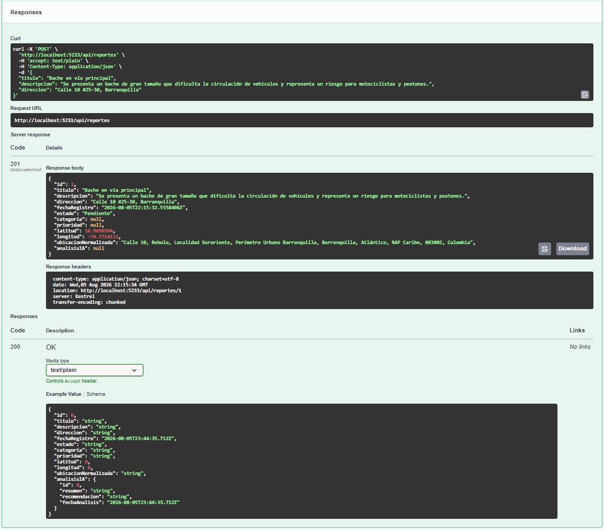

### Evidencia 2

La segunda captura complementa la evidencia anterior y permite visualizar con mayor detalle la solicitud y la respuesta obtenida durante la creación del reporte.

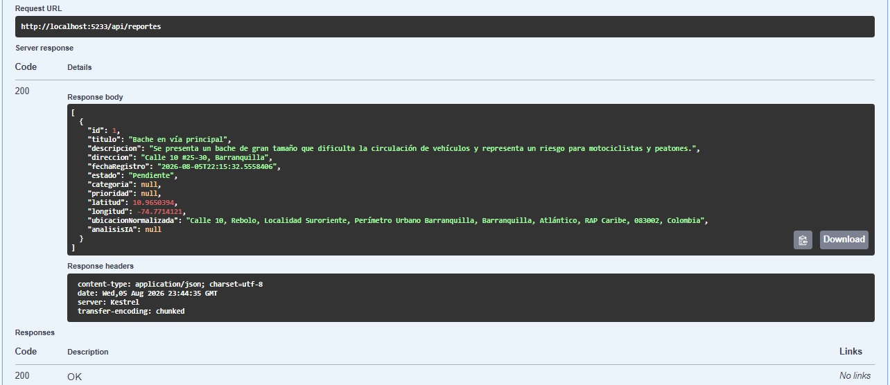

### Resultado de la evidencia

| Evidencia | Estado |
|---|---|
| Creación del reporte mediante `POST /api/reportes` | **Validado con evidencia** |

---

## 21.2 CP-002 — Consulta del reporte creado

| Campo | Valor |
|---|---|
| **Identificador** | `CP-002` |
| **Endpoint** | `GET /api/reportes` |
| **Tipo de prueba** | Consulta de reportes |
| **Objetivo** | Verificar la consulta de los reportes registrados. |
| **Datos de entrada** | Sin parámetros de consulta. |
| **Resultado esperado** | HTTP `200` y listado de reportes registrados. |
| **Resultado obtenido** | HTTP `200`. Se recuperó correctamente el reporte registrado previamente mediante `CP-001`. |
| **Estado** | **Aprobado** |

### Evidencia 1

La siguiente captura corresponde a la consulta de los reportes registrados mediante el endpoint `GET /api/reportes`.

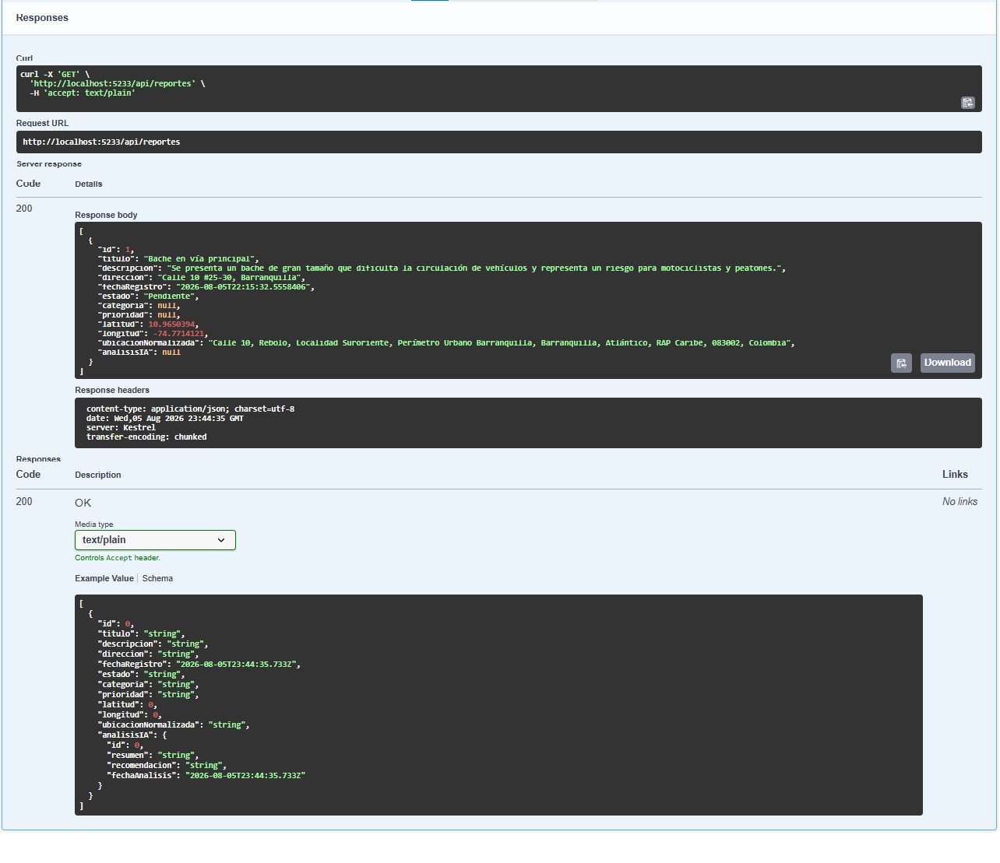

### Evidencia 2

La segunda captura complementa la evidencia anterior y permite visualizar con mayor detalle la solicitud y la respuesta obtenida en la consulta del reporte registrado.

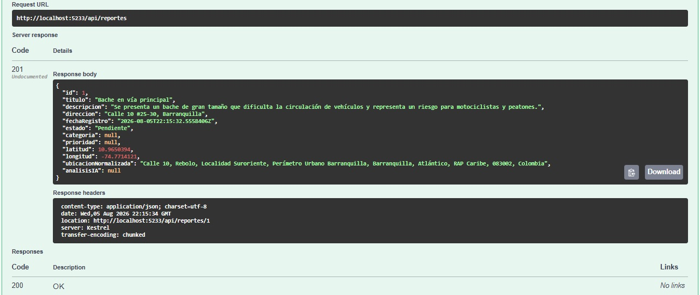

### Resultado de la evidencia

| Evidencia | Estado |
|---|---|
| Consulta mediante `GET /api/reportes` | **Validado con evidencia** |

---

## 21.3 CP-003 — Consultar un reporte por ID — Caso válido

| Campo | Valor |
|---|---|
| **Identificador** | `CP-003` |
| **Endpoint** | `GET /api/reportes/{id}` |
| **Tipo de prueba** | Funcional — Caso válido |
| **Datos de entrada** | `id = 1` |
| **Objetivo** | Verificar la consulta de un reporte específico mediante su identificador. |
| **Resultado esperado** | La API devuelve el reporte correspondiente con código HTTP `200 OK`. |
| **Resultado obtenido** | Se obtuvo correctamente el reporte con identificador `1`. |
| **Estado** | **Aprobado** |

### Evidencia

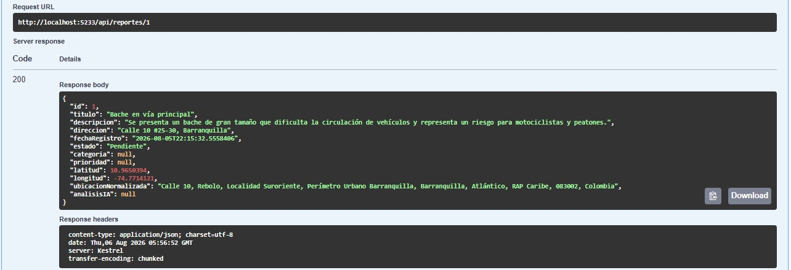

---

## 21.4 CP-004 — Consultar un reporte por ID — Caso inválido

| Campo | Valor |
|---|---|
| **Identificador** | `CP-004` |
| **Endpoint** | `GET /api/reportes/{id}` |
| **Tipo de prueba** | Funcional — Caso inválido |
| **Datos de entrada** | `id = 20` |
| **Objetivo** | Verificar el comportamiento del sistema cuando se consulta un identificador inexistente. |
| **Resultado esperado** | La API responde con código HTTP `404 Not Found`. |
| **Resultado obtenido** | La API devolvió correctamente el código `404 Not Found`, indicando que el recurso solicitado no existe. |
| **Estado** | **Aprobado** |

### Evidencia

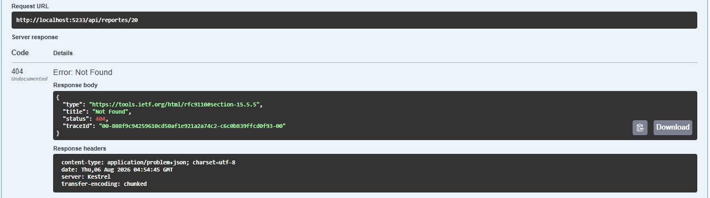

---

## 21.5 CP-005 — Actualizar un reporte existente — Caso válido

| Campo | Valor |
|---|---|
| **Identificador** | `CP-005` |
| **Endpoint** | `PUT /api/reportes/{id}` |
| **Tipo de prueba** | Funcional — Caso válido |
| **Objetivo** | Verificar la actualización de un reporte existente. |
| **Datos de entrada** | `id = 1` y JSON con nuevos valores para título, descripción, dirección y estado. |
| **Resultado esperado** | La API actualiza correctamente el reporte y devuelve el recurso modificado con código HTTP `200 OK`. |
| **Resultado obtenido** | El reporte fue actualizado correctamente. Los cambios se reflejaron en la respuesta de la API y se conservaron los demás datos del registro. |
| **Estado** | **Aprobado** |

### Evidencia

La siguiente captura corresponde a la ejecución exitosa del endpoint `PUT /api/reportes/{id}` desde Swagger.

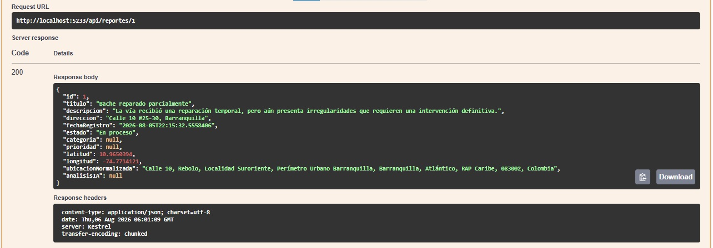

### Verificación de persistencia

Posteriormente se ejecutó el endpoint `GET /api/reportes/1`, confirmando que los cambios realizados mediante la operación de actualización fueron almacenados correctamente en la base de datos y recuperados sin inconsistencias. :contentReference[oaicite:1]{index=1}

### Resultado de la evidencia

| Evidencia | Estado |
|---|---|
| Actualización del reporte mediante `PUT /api/reportes/{id}` | **Validado con evidencia** |

---

## 21.6 CP-006 — Actualizar un reporte inexistente — Caso inválido

| Campo | Valor |
|---|---|
| **Identificador** | `CP-006` |
| **Endpoint** | `PUT /api/reportes/{id}` |
| **Tipo de prueba** | Funcional — Caso inválido |
| **Objetivo** | Verificar el comportamiento de la API al intentar actualizar un reporte inexistente. |
| **Datos de entrada** | `id = 20` y un cuerpo JSON válido. |
| **Resultado esperado** | La API responde con código HTTP `404 Not Found` sin modificar información en la base de datos. |
| **Resultado obtenido** | La API devolvió correctamente el código `404 Not Found`, indicando que el recurso solicitado no existe. |
| **Estado** | **Aprobado** |

### Evidencia

La siguiente captura corresponde a la ejecución del endpoint `PUT /api/reportes/{id}` utilizando un identificador inexistente (`20`).

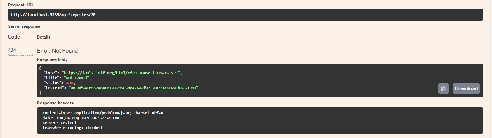

### Resultado de la evidencia

| Evidencia | Estado |
|---|---|
| Manejo de actualización sobre un reporte inexistente | **Validado con evidencia** |

---
## 21.7 CP-007 — Eliminar un reporte existente — Caso válido

| Campo | Valor |
|---|---|
| **Identificador** | `CP-007` |
| **Endpoint** | `DELETE /api/reportes/{id}` |
| **Tipo de prueba** | Funcional — Caso válido |
| **Objetivo** | Verificar la eliminación de un reporte existente. |
| **Datos de entrada** | `id = 1` |
| **Resultado esperado** | La API elimina correctamente el reporte y responde con código HTTP `204 No Content`. |
| **Resultado obtenido** | El reporte fue eliminado correctamente y la API devolvió el código `204 No Content`, sin contenido en el cuerpo de la respuesta. |
| **Estado** | **Aprobado** |

### Evidencia

La siguiente captura corresponde a la ejecución del endpoint `DELETE /api/reportes/{id}` desde Swagger.

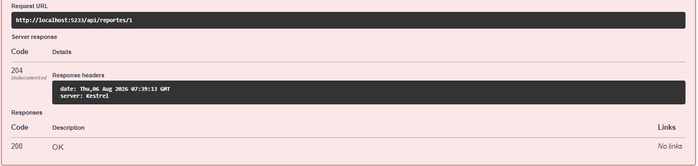

### Verificación de persistencia

Posteriormente se ejecutó el endpoint `GET /api/reportes/1`, obteniéndose una respuesta HTTP `404 Not Found`. Esto confirmó que el reporte fue eliminado correctamente de la base de datos y ya no podía ser consultado. :contentReference[oaicite:3]{index=3}

### Resultado de la evidencia

| Evidencia | Estado |
|---|---|
| Eliminación del reporte mediante `DELETE /api/reportes/{id}` | **Validado con evidencia** |
| Verificación posterior mediante `GET /api/reportes/1` | **Eliminación confirmada** |

---

## 21.8 CP-008 — Eliminar un reporte inexistente — Caso inválido

| Campo | Valor |
|---|---|
| **Identificador** | `CP-008` |
| **Endpoint** | `DELETE /api/reportes/{id}` |
| **Tipo de prueba** | Funcional — Caso inválido |
| **Objetivo** | Verificar el comportamiento de la API al intentar eliminar un reporte inexistente. |
| **Datos de entrada** | `id = 20` |
| **Resultado esperado** | La API responde con código HTTP `404 Not Found` sin modificar la base de datos. |
| **Resultado obtenido** | La API devolvió correctamente el código `404 Not Found`, indicando que el recurso solicitado no existe. |
| **Estado** | **Aprobado** |

### Evidencia

La siguiente captura corresponde a la ejecución del endpoint `DELETE /api/reportes/{id}` utilizando un identificador inexistente (`20`).

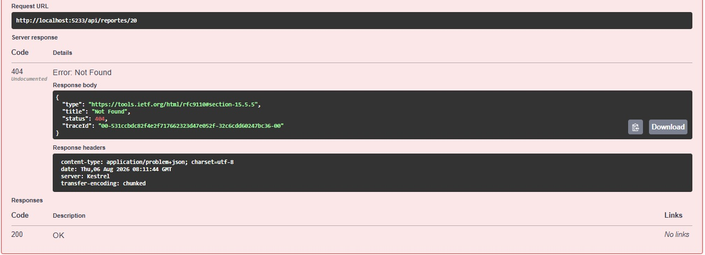

### Resultado de la evidencia

| Evidencia | Estado |
|---|---|
| Manejo de eliminación sobre un reporte inexistente | **Validado con evidencia** |

---

---

## 21.9 CP-009 — Análisis inteligente de un reporte mediante IA

| Campo | Valor |
|---|---|
| **Identificador** | `CP-009` |
| **Endpoint** | `POST /api/reportes/{id}/analizar` |
| **Tipo de prueba** | Integración con IA |
| **Objetivo** | Verificar que la API envía correctamente un reporte a Groq y recibe un análisis automatizado. |
| **Datos de entrada** | `id = 3` |
| **Resultado esperado** | La IA clasifica el reporte, asigna una prioridad, genera un resumen y una recomendación. |
| **Resultado obtenido** | La IA respondió correctamente con la categoría, prioridad, resumen y recomendación del reporte. |
| **Código HTTP** | `200 OK` |
| **Estado** | **Aprobado** |

### Evidencia

La siguiente captura corresponde a la ejecución exitosa del endpoint `POST /api/reportes/{id}/analizar`. La aplicación envió el reporte a Groq y recibió el análisis generado mediante Inteligencia Artificial.

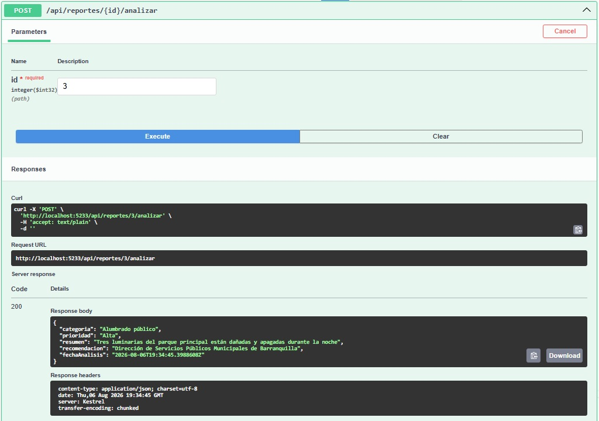

### Resultado de la evidencia

| Evidencia | Estado |
|---|---|
| Análisis del reporte mediante IA | **Validado con evidencia** |

---

## 21.10 CP-010 — Persistencia del análisis generado por IA

| Campo | Valor |
|---|---|
| **Identificador** | `CP-010` |
| **Endpoint** | `GET /api/reportes/{id}` |
| **Tipo de prueba** | Integración / Persistencia |
| **Objetivo** | Verificar que el análisis generado por Groq se almacena correctamente en la base de datos. |
| **Datos de entrada** | `id = 3` |
| **Resultado esperado** | El reporte contiene la categoría, prioridad y el objeto `analisisIA` con el resumen, la recomendación y la fecha del análisis. |
| **Resultado obtenido** | El reporte fue recuperado correctamente y contiene toda la información generada por la IA. |
| **Código HTTP** | `200 OK` |
| **Estado** | **Aprobado** |

### Evidencia

La siguiente captura corresponde a la consulta del reporte mediante `GET /api/reportes/{id}` después de ejecutar el análisis mediante IA.

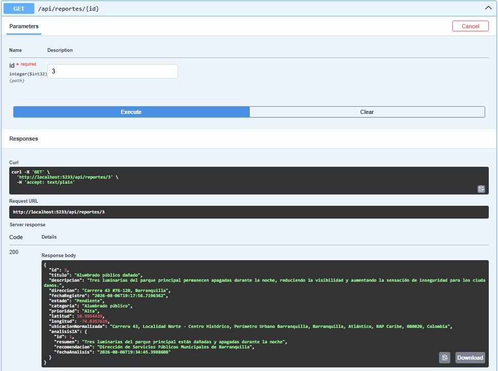

### Verificación

La respuesta permite comprobar que la categoría, la prioridad y el objeto `analisisIA` fueron almacenados correctamente y posteriormente recuperados desde la base de datos.

### Resultado de la evidencia

| Evidencia | Estado |
|---|---|
| Persistencia del análisis generado por IA | **Validado con evidencia** |

---

## 21.11 CP-011 — Validación del campo obligatorio Título

| Campo | Valor |
|---|---|
| **Identificador** | `CP-011` |
| **Endpoint** | `POST /api/reportes` |
| **Tipo de prueba** | Validación |
| **Objetivo** | Verificar que el sistema impida la creación de un reporte cuando el campo `Título` se envía vacío. |
| **Resultado esperado** | La API rechaza la solicitud y devuelve HTTP `400 Bad Request`, indicando que el campo es obligatorio y que debe cumplir las restricciones de longitud configuradas. |
| **Resultado obtenido** | La API rechazó correctamente la solicitud con HTTP `400 Bad Request` y mostró los mensajes de validación correspondientes. |
| **Estado** | **Aprobado** |

### Evidencia 1

La primera captura corresponde al envío del reporte con el campo `Título` vacío.

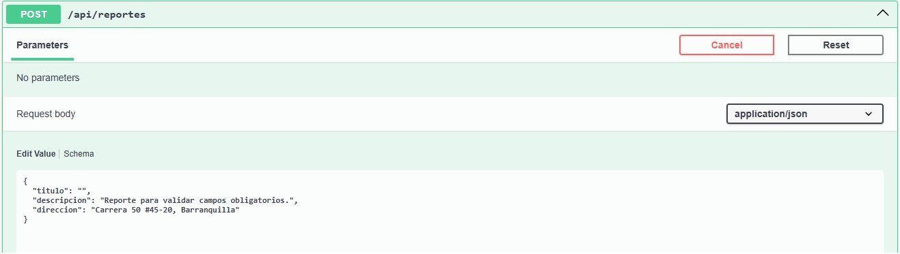

### Evidencia 2

La segunda captura permite visualizar la respuesta de la API y los mensajes asociados a la validación del campo obligatorio.

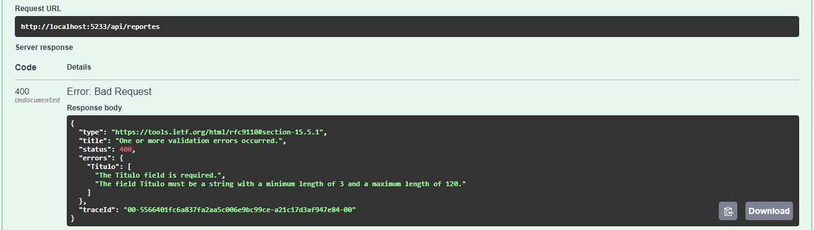

### Resultado de la evidencia

| Evidencia | Estado |
|---|---|
| Rechazo de solicitud con título vacío | **Validado con evidencia** |
| Respuesta HTTP `400 Bad Request` | **Validado con evidencia** |

---

## 21.12 CP-012 — Validación del campo obligatorio Descripción

| Campo | Valor |
|---|---|
| **Identificador** | `CP-012` |
| **Endpoint** | `POST /api/reportes` |
| **Tipo de prueba** | Validación |
| **Objetivo** | Verificar que la API rechace la creación de un reporte cuando el campo `Descripción` se envía vacío o no cumple la longitud mínima definida. |
| **Resultado esperado** | La API rechaza la solicitud con HTTP `400 Bad Request` y muestra los mensajes correspondientes a la validación del campo. |
| **Resultado obtenido** | La API rechazó correctamente la solicitud cuando la descripción estaba vacía y mostró los mensajes correspondientes sobre obligatoriedad y longitud permitida. |
| **Estado** | **Aprobado** |

### Evidencia 1

La primera captura corresponde al envío del reporte con el campo `Descripción` vacío.

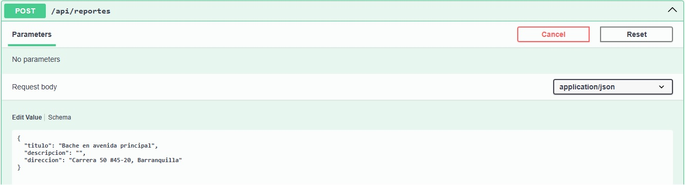

### Evidencia 2

La segunda captura permite visualizar la respuesta de la API y los mensajes generados por la validación.

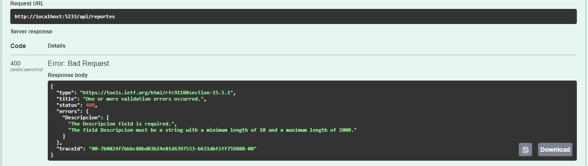

### Resultado de la evidencia

| Evidencia | Estado |
|---|---|
| Rechazo de solicitud con descripción vacía | **Validado con evidencia** |
| Respuesta HTTP `400 Bad Request` | **Validado con evidencia** |

---

## 21.13 CP-013 — Validación del campo obligatorio Dirección

| Campo | Valor |
|---|---|
| **Identificador** | `CP-013` |
| **Endpoint** | `POST /api/reportes` |
| **Tipo de prueba** | Validación |
| **Objetivo** | Verificar que la API rechace la creación de un reporte cuando el campo `Dirección` se envía vacío o no cumple la longitud mínima definida. |
| **Resultado esperado** | La API rechaza la solicitud con HTTP `400 Bad Request` y muestra los mensajes correspondientes a la validación del campo. |
| **Resultado obtenido** | La API rechazó correctamente la solicitud cuando la dirección estaba vacía y mostró los mensajes correspondientes sobre obligatoriedad y longitud permitida. |
| **Estado** | **Aprobado** |

### Evidencia 1

La primera captura corresponde al envío del reporte con el campo `Dirección` vacío.

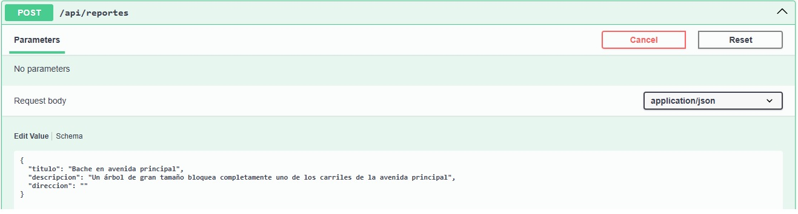

### Evidencia 2

La segunda captura permite visualizar la respuesta de la API y los mensajes generados por la validación del campo obligatorio.

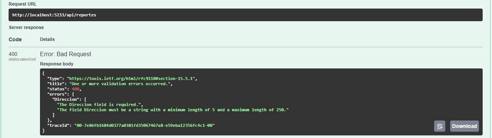

### Resultado de la evidencia

| Evidencia | Estado |
|---|---|
| Rechazo de solicitud con dirección vacía | **Validado con evidencia** |
| Respuesta HTTP `400 Bad Request` | **Validado con evidencia** |

---

## 21.14 Resumen General de las Pruebas Ejecutadas

### Resumen de pruebas funcionales y de calidad

Durante el proceso de aseguramiento de la calidad (QA) se ejecutaron pruebas funcionales, de integración, validación y manejo de errores sobre los principales componentes del Sistema Inteligente de Reportes Ciudadanos con IA.

El objetivo fue verificar el correcto funcionamiento de la API REST, la persistencia de los datos, la integración con servicios externos, la generación y persistencia del análisis mediante Inteligencia Artificial y el cumplimiento de las reglas de validación implementadas.

Las pruebas permitieron comprobar el funcionamiento de las operaciones CRUD de reportes, la geocodificación automática de direcciones, la integración con la API de Groq para el análisis inteligente de reportes y la validación de los datos de entrada.

En todos los casos evaluados se obtuvo el comportamiento esperado, evidenciando que la aplicación responde correctamente ante solicitudes de creación, consulta, actualización, eliminación, análisis mediante IA y solicitudes con datos inválidos.

---

### Matriz General de Casos de Prueba

| Código | Endpoint / Operación | Tipo de prueba | Resultado | Estado |
|---|---|---|---|---|
| `CP-001` | `POST /api/reportes` | Creación de reporte | HTTP `201` | **Aprobado** |
| `CP-002` | `GET /api/reportes` | Consulta general | HTTP `200` | **Aprobado** |
| `CP-003` | `GET /api/reportes/{id}` | Caso válido | HTTP `200` | **Aprobado** |
| `CP-004` | `GET /api/reportes/{id}` | Caso inválido | HTTP `404` | **Aprobado** |
| `CP-005` | `PUT /api/reportes/{id}` | Caso válido | HTTP `200` | **Aprobado** |
| `CP-006` | `PUT /api/reportes/{id}` | Caso inválido | HTTP `404` | **Aprobado** |
| `CP-007` | `DELETE /api/reportes/{id}` | Caso válido | HTTP `204` | **Aprobado** |
| `CP-008` | `DELETE /api/reportes/{id}` | Caso inválido | HTTP `404` | **Aprobado** |
| `CP-009` | `POST /api/reportes/{id}/analizar` | Integración con IA | HTTP `200` | **Aprobado** |
| `CP-010` | `GET /api/reportes/{id}` | Persistencia del análisis IA | HTTP `200` | **Aprobado** |
| `CP-011` | `POST /api/reportes` | Validación de Título | HTTP `400` | **Aprobado** |
| `CP-012` | `POST /api/reportes` | Validación de Descripción | HTTP `400` | **Aprobado** |
| `CP-013` | `POST /api/reportes` | Validación de Dirección | HTTP `400` | **Aprobado** |

---

### Resultado general

| Indicador | Resultado |
|---|---:|
| **Total de casos ejecutados** | **13** |
| **Casos aprobados** | **13** |
| **Casos fallidos** | **0** |
| **Porcentaje de éxito** | **100 %** |

Las pruebas fueron ejecutadas sobre la implementación funcional del proyecto utilizando Swagger como herramienta principal de validación y fueron respaldadas mediante capturas de pantalla. :contentReference[oaicite:1]{index=1}

---

## 21.15 Checklist Final de QA

Antes de la entrega del proyecto se verificó el cumplimiento de los principales requisitos funcionales y técnicos establecidos para la aplicación.

| Verificación | Estado |
|---|---|
| API REST implementada | **✔ Cumplido** |
| CRUD completamente funcional | **✔ Cumplido** |
| Persistencia en SQLite | **✔ Cumplido** |
| Entity Framework Core configurado | **✔ Cumplido** |
| Swagger operativo | **✔ Cumplido** |
| Geocodificación automática | **✔ Cumplido** |
| Integración con Groq | **✔ Cumplido** |
| Generación automática del análisis IA | **✔ Cumplido** |
| Persistencia del análisis IA | **✔ Cumplido** |
| Validaciones de entrada implementadas | **✔ Cumplido** |
| Manejo de errores HTTP | **✔ Cumplido** |
| Evidencias de funcionamiento recopiladas | **✔ Cumplido** |
| Casos válidos documentados | **✔ Cumplido** |
| Casos inválidos documentados | **✔ Cumplido** |

### Estado final

El proyecto cumple satisfactoriamente los criterios de calidad definidos para su entrega, evidenciando el correcto funcionamiento de los componentes desarrollados y la integración entre los diferentes servicios utilizados. :contentReference[oaicite:3]{index=3}

---

## 21.16 Conclusiones del Proceso de QA

El proceso de aseguramiento de la calidad permitió validar el correcto funcionamiento del Sistema Inteligente de Reportes Ciudadanos con IA, verificando tanto las operaciones CRUD como la integración con servicios externos y las reglas de validación implementadas.

Las pruebas demostraron que la aplicación gestiona adecuadamente el ciclo de vida de los reportes ciudadanos, realiza la geocodificación automática de direcciones, se comunica exitosamente con la API de Groq para generar análisis inteligentes y almacena correctamente los resultados obtenidos en la base de datos.

Asimismo, se comprobó que las validaciones implementadas mediante ASP.NET Core impiden el registro de información inválida y que la API responde con códigos HTTP apropiados ante diferentes escenarios de uso.

En conjunto, las evidencias recopiladas permiten concluir que la solución desarrollada cumple los objetivos funcionales definidos para el proyecto, presenta un comportamiento estable durante las pruebas realizadas y constituye una base sólida para futuras mejoras.

Entre las posibles mejoras futuras se contempla la incorporación de mecanismos de autenticación, notificaciones, paneles estadísticos y aplicaciones cliente para dispositivos móviles y web. :contentReference[oaicite:5]{index=5}

---
