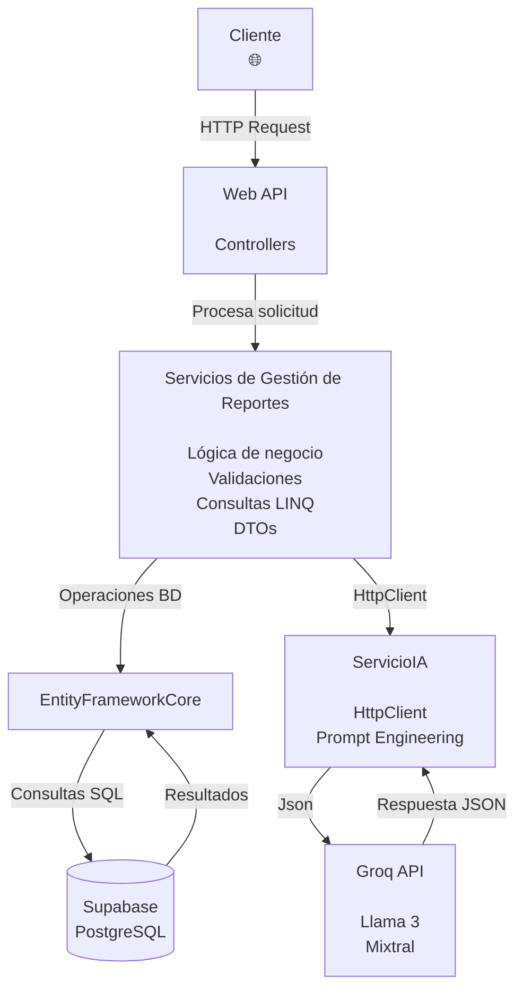

<div align="center">

# Sistema Inteligente de Reportes Ciudadanos con IA

## Proyecto Final del Diplomado en Desarrollo .NET

### Objetivo de Desarrollo Sostenible (ODS 11)

#### Ciudades y Comunidades Sostenibles
---
API REST desarrollada con **ASP.NET Core**, **Entity Framework Core**, **SQLite**, **Groq IA** y consumo de **APIs externas** mediante **HttpClient**.
</div>

### Objetivo del Proyecto

El presente proyecto consiste en desarrollar una **API REST** denominada **Sistema Inteligente de Reportes Ciudadanos con IA**, alineada con el **Objetivo de Desarrollo Sostenible (ODS 11): Ciudades y Comunidades Sostenibles**.

La API permitirá registrar, consultar, actualizar y administrar reportes ciudadanos relacionados con problemáticas presentes en el entorno urbano, entre ellas:

- Baches en las vías.
- Fallas en el alumbrado público.
- Acumulación de basuras.
- Daños en zonas verdes.
- Afectaciones al espacio público.

Toda la información será almacenada en una base de datos mediante **Entity Framework Core** y **SQLite**.

Además, el sistema integrará una API de **Inteligencia Artificial (Groq)** para analizar automáticamente la descripción enviada por el ciudadano y realizar las siguientes acciones:

- Clasificar el tipo de reporte.
- Asignar un nivel de prioridad.
- Generar un resumen del incidente.
- Recomendar la entidad responsable de atender el caso.

Adicionalmente, el proyecto consumirá una **API externa** mediante **HttpClient** para complementar la información del reporte cuando sea necesario, intercambiando la información en formato **JSON** y siguiendo una arquitectura orientada a servicios que permita desarrollar una solución organizada, escalable y fácil de mantener.

### Organización del Equipo

| Rol | Responsabilidad |
|------|-----------------|
| Backend / TL | Definir la arquitectura general del sistema, recursos y endpoints principales. |
| API / IA | Diseñar e implementar la integración con Inteligencia Artificial (Groq). |
| BD / DTOs | Diseñar modelos, relaciones, DTOs, validaciones y persistencia de datos. |
| Docs / QA | Elaborar la documentación del proyecto, ejemplos de uso y casos de prueba. |

---

## Actividad 1 - Definición del Problema

---

### Descripción del Problema

Actualmente, los ciudadanos enfrentan dificultades para reportar de forma organizada las diferentes problemáticas que afectan su comunidad. En muchos casos, estos reportes se realizan mediante llamadas telefónicas, redes sociales o canales informales, lo que dificulta el seguimiento de cada caso y retrasa la atención por parte de las entidades responsables.

Entre las principales problemáticas urbanas que serán gestionadas por el sistema se encuentran:

- Baches en las vías.
- Fallas en el alumbrado público.
- Acumulación de residuos sólidos.
- Daños en parques y zonas verdes.
- Afectaciones al espacio público.

Como consecuencia, la información suele encontrarse dispersa, sin una adecuada clasificación ni un mecanismo que permita establecer prioridades de atención.

---

### Beneficiarios

La solución propuesta beneficiará principalmente a los siguientes actores:

| Beneficiario | Beneficio obtenido |
|--------------|--------------------|
| Ciudadanos | Podrán registrar y consultar reportes de manera organizada y centralizada. |
| Entidades públicas | Dispondrán de información estructurada para facilitar la toma de decisiones y priorizar la atención de los incidentes. |

---

### Solución Propuesta

La solución consiste en desarrollar una **API REST** denominada **Sistema Inteligente de Reportes Ciudadanos con IA**, que permitirá:

- Registrar reportes ciudadanos.
- Consultar reportes registrados.
- Actualizar la información de un reporte.
- Administrar el ciclo de vida de cada incidente.
- Analizar automáticamente cada reporte mediante Inteligencia Artificial.

La integración con **Groq IA** permitirá analizar la descripción enviada por el ciudadano para:

- Clasificar automáticamente la categoría del incidente.
- Asignar un nivel de prioridad.
- Generar un resumen del reporte.
- Recomendar la entidad responsable de atender el caso.

Toda la información será almacenada en una base de datos para garantizar la trazabilidad de cada reporte y facilitar futuras consultas.

---

### Relación con el Objetivo de Desarrollo Sostenible (ODS 11)

El proyecto se encuentra alineado con el **Objetivo de Desarrollo Sostenible (ODS 11): Ciudades y Comunidades Sostenibles**, promoviendo el uso de la tecnología para mejorar la gestión de los problemas urbanos y contribuir a una mejor calidad de vida para la comunidad.

---

> [!TIP]
> La incorporación de Inteligencia Artificial permitirá automatizar el análisis inicial de los reportes ciudadanos, facilitando su clasificación y priorización para optimizar el tiempo de respuesta de las entidades encargadas.

---

### Resultado Esperado

Al finalizar el desarrollo del proyecto se espera disponer de una API capaz de centralizar los reportes ciudadanos, analizarlos mediante Inteligencia Artificial y proporcionar información organizada que facilite la gestión y atención de las problemáticas urbanas.

---
## Actividad 2 - Funcionalidad General de la API

---

### Funcionalidad General

Nuestra API permitirá registrar, administrar y analizar reportes ciudadanos sobre problemáticas urbanas, utilizando Inteligencia Artificial para clasificarlos, asignarles una prioridad y facilitar su gestión por parte de las entidades responsables.

---

### Funcionalidades Principales

1. Registrar un reporte ciudadano.
2. Consultar todos los reportes registrados.
3. Consultar un reporte por su identificador.
4. Actualizar la información de un reporte.
5. Eliminar un reporte.
6. Analizar automáticamente el reporte mediante Inteligencia Artificial.
7. Filtrar reportes por categoría, estado o rango de fechas.
8. Consultar el resultado del análisis realizado por la IA.

---

### Módulos del Sistema

| Módulo | Funcionalidad |
|---------|---------------|
| **Reportes Ciudadanos** | Registrar, consultar, actualizar y eliminar reportes ciudadanos. |
| **Inteligencia Artificial** | Analizar el contenido del reporte, clasificarlo por categoría, asignar una prioridad y generar una recomendación. |
| **Consultas** | Filtrar reportes por categoría, estado, prioridad o rango de fechas. |
| **Integración Externa** | Obtener información complementaria del reporte mediante una API externa (por ejemplo, geocodificación de la ubicación). |

---
## Actividad 3 - Recurso Principal y Modelado de Datos

---

### Recurso Principal

- **Reporte Ciudadano**

---

### Modelo 1: Reporte

| Campo | Tipo de Dato | Obligatorio | Descripción |
|--------|--------------|-------------|-------------|
| Id | Int | Sí | Identificador único del reporte. |
| Titulo | String | Sí | Título corto que describe el problema. |
| Descripción | String | Sí | Descripción detallada del reporte. |
| Dirección | String | Sí | Dirección o ubicación donde ocurre el problema. |
| FechaRegistro | DateTime | Sí | Fecha y hora en que se registró el reporte. |
| Estado | String | Sí | Estado del reporte (Pendiente, En proceso o Resuelto). |
| Categoría | String | No | Categoría asignada por la IA (Basuras, Alumbrado, Baches, etc.). |
| Prioridad | String | No | Nivel de prioridad asignado por la IA (Alta, Media o Baja). |

---

### Modelo 2: AnalisisIA

| Campo | Tipo de Dato | Obligatorio | Descripción |
|--------|--------------|-------------|-------------|
| Id | Int | Sí | Identificador de análisis. |
| ResumenId | Int | Sí | Identificador del reporte asociado. |
| Resumen | String | Sí | Resumen generado por la inteligencia artificial. |
| Recomendación | String | Sí | Recomendación generada por la IA para la atención del caso. |
| FechaAnalisis | DateTime | Sí | Fecha en la que se realizó el análisis. |

---

### Relación entre modelos

- Un **Reporte** puede tener un único **Análisis** realizado por la IA.
- Un **AnálisisIA** pertenece únicamente a un **Reporte**.

**Relación:**

```text
Reporte (1) ------------------------- (1) AnalisisIA
```
---
## Actividad 4 - Endpoints Principales

---

### Endpoints de la API

| Método HTTP | Endpoint | Descripción | Datos de Entrada | Respuesta Esperada |
|--------------|----------|-------------|------------------|--------------------|
| **GET** | `/api/reportes` | Consultar todos los reportes ciudadanos. | Ninguno. | Lista de reportes registrados. |
| **GET** | `/api/reportes/{id}` | Consultar un reporte específico por su identificador. | Id del reporte. | Información completa del reporte. |
| **POST** | `/api/reportes` | Registrar un nuevo reporte ciudadano. | Título, descripción y dirección. | Reporte creado correctamente. |
| **PUT** | `/api/reportes/{id}` | Actualizar la información de un reporte. | Id y datos actualizados. | Reporte actualizado correctamente. |
| **DELETE** | `/api/reportes/{id}` | Eliminar un reporte del sistema. | Id del reporte. | Confirmación de eliminación. |
| **POST** | `/api/reportes/{id}/analizar` | Analizar el reporte mediante Inteligencia Artificial. | Id del reporte. | Categoría, prioridad, resumen y recomendación generados por la IA. |
| **GET** | `/api/reportes?categoria={categoria}` | Filtrar reportes por categoría. | Categoría. | Lista de reportes de la categoría indicada. |
| **GET** | `/api/reportes?estado={estado}` | Filtrar reportes por estado. | Estado (Pendiente, En proceso o Resuelto). | Lista de reportes según el estado. |
| **GET** | `/api/reportes?prioridad={prioridad}` | Filtrar reportes por prioridad. | Prioridad (Alta, Media o Baja). | Lista de reportes según la prioridad. |
| **GET** | `/api/reportes?fechaInicio={fecha1}&fechaFin={fecha2}` | Consultar reportes dentro de un rango de fechas. | Fecha inicial y fecha final. | Lista de reportes registrados en ese período. |

---

#### Resumen de Endpoints

| Método | Cantidad |
|---------|:--------:|
| GET | 5 |
| POST | 2 |
| PUT | 1 |
| DELETE | 1 |

**Total de Endpoints:** **9**

---
## Actividad 5 - Integración con Inteligencia Artificial

---

### Integración con Inteligencia Artificial

La API enviará al modelo de Inteligencia Artificial la descripción del reporte ciudadano, junto con su título y, si está disponible, la dirección donde ocurre el incidente.

El modelo de IA deberá analizar el contenido del reporte para identificar la categoría del problema, asignar un nivel de prioridad, generar un resumen del incidente y recomendar la entidad o dependencia responsable de atenderlo.

La respuesta del modelo deberá devolverse en formato JSON con la siguiente estructura:

```json
{
  "categoria": "Alumbrado Público",
  "prioridad": "Alta",
  "resumen": "Falla del sistema de iluminación en una vía pública.",
  "recomendación": "Remitir el caso a la Secretaría de Infraestructura para su atención."
}
```

El resultado del análisis se almacenará en la base de datos, asociado al reporte correspondiente, para que pueda consultarse posteriormente sin necesidad de volver a ejecutar el análisis.

Si la Inteligencia Artificial no responde u ocurre un error durante la comunicación con la API de Groq, el reporte ciudadano se almacenará normalmente en la base de datos con estado **"Pendiente de análisis"**. De esta forma, la información no se perderá y el análisis podrá ejecutarse nuevamente cuando el servicio de IA esté disponible.

---

### Entrada - Ejemplo

```json
{
  "titulo": "Alumbrado público dañado",
  "descripción": "En el barrio no funciona el alumbrado público desde hace dos semanas y la zona permanece completamente oscura durante las noches.",
  "dirección": "Calle 15 #20-35, Barranquilla"
}
```

---

### Respuesta Esperada

```json
{
  "categoria": "Alumbrado Público",
  "prioridad": "Alta",
  "resumen": "Falla prolongada del alumbrado público en una zona residencial.",
  "recomendación": "Remitir el caso a la Secretaría de Infraestructura para realizar la inspección y reparación correspondiente."
}
```
---

## Actividad 6 - Diagrama General del Sistema

---

### Diagrama General del Sistema

El siguiente diagrama representa la arquitectura general del **Sistema Inteligente de Reportes Ciudadanos con IA**, mostrando la interacción entre el cliente, la Web API, la lógica de negocio, la base de datos y el servicio de Inteligencia Artificial.


---
